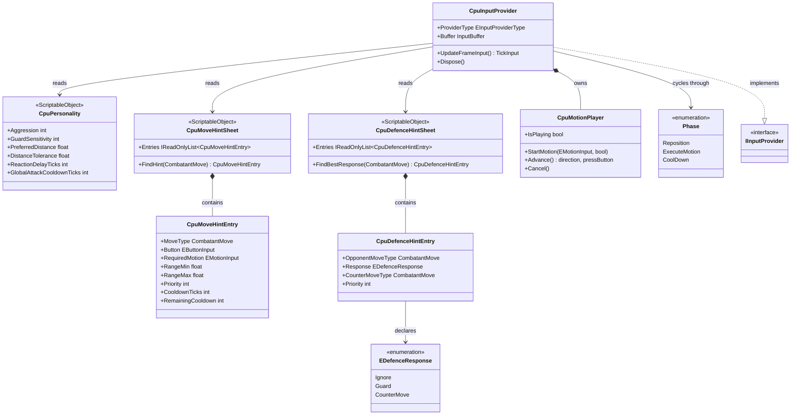
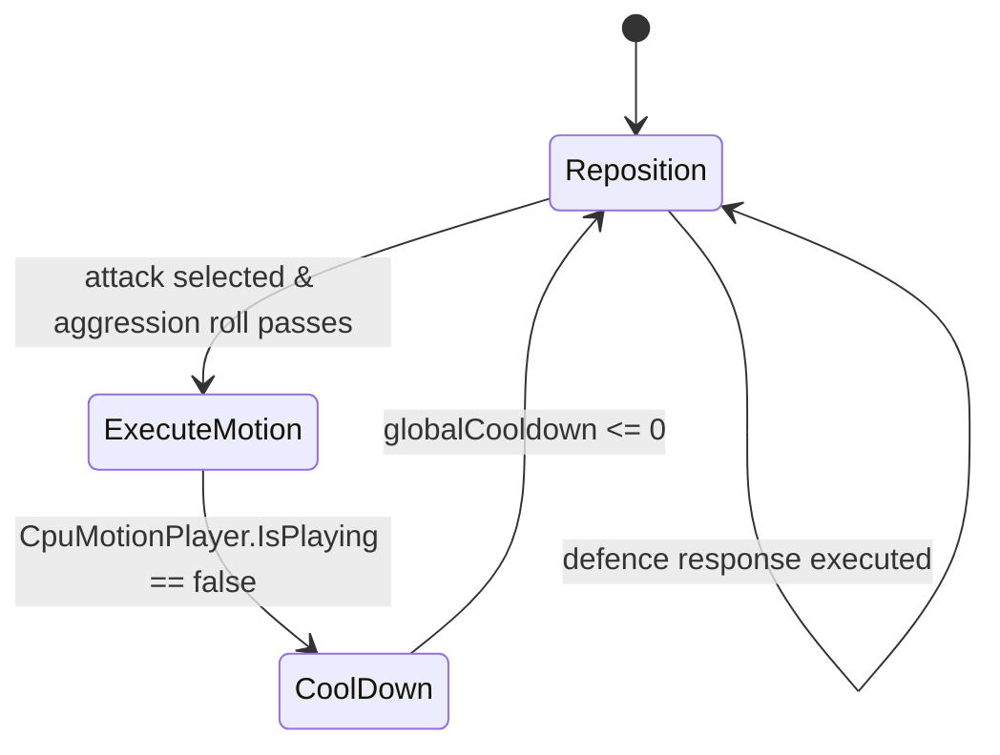

# CPU System

The CPU system implements an AI-controlled `IInputProvider` that produces `TickInput` snapshots
each tick. The AI cycles through three behavioural phases — Reposition, ExecuteMotion, CoolDown —
driven by a priority-ordered decision function (`Think`) that weighs the combatant's current
stun state, any in-progress motion, pending defence obligations, attack opportunities, and
spacing before choosing a direction and button output.

---

## Architecture



---

## Phase State Machine



The AI is always in one of three phases:

| Phase | Behaviour |
|---|---|
| `Reposition` | Moves toward or away from the opponent to reach `PreferredDistance`. Also the landing state after a defence response or cooldown. |
| `ExecuteMotion` | `CpuMotionPlayer` is outputting a direction+button sequence toward `MotionMatcher`. Exits as soon as the motion finishes playing. |
| `CoolDown` | Neutral wait period after an attack attempt. Prevents the AI from attacking every tick. Exits when `GlobalAttackCooldownTicks` and the per-move cooldown both expire. |

---

## Components

### CpuInputProvider

`IInputProvider, IDisposable`. Created by `CombatManager.PrepareCombat` when no real player
provider is supplied for a slot. Subscribes to combatant events in its constructor; must be
disposed to unsubscribe.

**Decision priority in `Think()`** (evaluated in order, first match wins):

1. **Stunned** — if the AI's combatant is in hitstun or blockstun, output neutral or held-back.
2. **In-motion** — if `CpuMotionPlayer.IsPlaying`, advance the motion sequence and return its output.
3. **Defend** — if a pending defence obligation exists and the reaction delay has expired,
   execute the defence response.
4. **Attack** — if off cooldown, pick the best attack from `CpuMoveHintSheet` and roll against
   `Aggression`. On success, start `ExecuteMotion`.
5. **Reposition** — fall through to spacing adjustment.

**Threat detection** — when the opponent's `MoveRunner.OnMoveStarted` fires,
`HandleOpponentMoveStarted` looks up the move in `CpuDefenceHintSheet`. If a non-Ignore entry
is found, the defence obligation is stored as `_pendingDefence`. A reaction delay countdown
(`_reactionDelay`) starts simultaneously. Only when both conditions are met (a response is
known and the delay has elapsed) does the AI act on the threat.

**Guard roll** — `TryGetDefenceResponse` applies `GuardSensitivity`: a random roll below the
threshold commits the AI to guarding regardless of the sheet's response. This gives the AI
human-like imperfect blocking even when no specific defence hint exists.

---

### CpuPersonality

`ScriptableObject` asset assigned per character in `CombatantDataSO`. All fields are tweakable
in the Inspector.

| Field | Range | Description |
|---|---|---|
| `Aggression` | 0–100 | Probability to attempt an attack when a viable move is found. 0 = passive, 100 = always attacks. |
| `GuardSensitivity` | 0–100 | Probability to begin guarding when the opponent enters Active phase. 0 = never blocks. |
| `PreferredDistance` | ≥ 0 | Desired world-unit spacing from the opponent. |
| `DistanceTolerance` | ≥ 0 | Dead zone around `PreferredDistance`; the AI only repositions when outside this band. |
| `ReactionDelayTicks` | 0–30 | Simulated reaction lag in ticks before the AI responds to a new threat. |
| `GlobalAttackCooldownTicks` | 0–120 | Minimum ticks between any two attack attempts. |

---

### CpuMoveHintSheet / CpuMoveHintEntry

`ScriptableObject` asset defining the AI's attack repertoire. One sheet per character;
assigned in `CombatantDataSO`.

**`CpuMoveHintEntry` fields:**

| Field | Description |
|---|---|
| `MoveType` | The `CombatantMove` subclass this entry refers to (for inspector readability). |
| `Button` | The `EButtonInput` flag(s) to press when executing this move. |
| `RequiredMotion` | The `EMotionInput` to perform before pressing the button. `None` = instant press. |
| `RangeMin` / `RangeMax` | World-unit horizontal distance range in which this move is viable. |
| `Priority` | Tie-breaking score when multiple in-range moves are candidates. Highest wins. |
| `CooldownTicks` | Minimum ticks between uses. Tracked in `RemainingCooldown` at runtime. |

`CpuMoveHintSheet.FindHint(move)` returns the first entry whose `MoveType` matches the given
move's type; returns null if not found.

---

### CpuDefenceHintSheet / CpuDefenceHintEntry

`ScriptableObject` asset defining the AI's reactive defence repertoire. One sheet per character;
assigned in `CombatantDataSO`.

**`CpuDefenceHintEntry` fields:**

| Field | Description |
|---|---|
| `OpponentMoveType` | The opponent's `CombatantMove` subclass this entry responds to. `null` = catch-all fallback. |
| `Response` | `Ignore`, `Guard`, or `CounterMove`. |
| `CounterMoveType` | Only used when `Response == CounterMove`; the move to execute from the AI's own sheet. |
| `Priority` | When multiple entries match the same move, the highest-priority one wins. |

`CpuDefenceHintSheet.FindBestResponse(move)` returns the highest-priority exact match, falling
back to the catch-all (`null` `OpponentMoveType`) if no exact match exists. Returns null if no
applicable entry is found.

**`EDefenceResponse` values:**

| Value | Behaviour |
|---|---|
| `Ignore` | Do nothing; AI continues its normal flow. |
| `Guard` | Hold back (Input4 in character space). |
| `CounterMove` | Immediately execute the move referenced by `CounterMoveType`. |

---

### CpuMotionPlayer

Internal helper that translates an `EMotionInput` value into a timed sequence of
`EDirectionInput` steps, outputting one direction per tick. The sequence is built from the same
direction grammar that `MotionMatcher` recognises, with per-step hold durations chosen to fit
within `MotionMatcher.MotionWindow` (20 ticks). Charge inputs hold for 35 ticks (5 ticks above
the required 30) to guarantee the charge registers.

| Method | Description |
|---|---|
| `StartMotion(motion, facingRight)` | Enqueues the direction sequence for `motion`; cancels any in-progress sequence first. |
| `Advance()` | Returns `(direction, pressButton)` for the current tick. Call every tick while `IsPlaying`. |
| `Cancel()` | Immediately abandons the current sequence. |
| `IsPlaying` | True while steps remain. |

---

## Public API

### CpuInputProvider

| Method / Property | Returns | Description |
|---|---|---|
| `ProviderType` | `EInputProviderType.Cpu` | Identifies this provider as AI-driven. |
| `Buffer` | `InputBuffer` | The frame-history ring buffer (120 frames, 2 s). |
| `UpdateFrameInput()` | `TickInput` | Calls `Think()`, writes the result to the buffer, returns the tick. |
| `Dispose()` | `void` | Unsubscribes from all combatant events. Call when the combat session ends. |

### CpuMoveHintSheet

| Method | Returns | Description |
|---|---|---|
| `Entries` | `IReadOnlyList<CpuMoveHintEntry>` | All attack hint entries. |
| `FindHint(move)` | `CpuMoveHintEntry?` | First entry matching the move's type; null on miss. |

### CpuDefenceHintSheet

| Method | Returns | Description |
|---|---|---|
| `Entries` | `IReadOnlyList<CpuDefenceHintEntry>` | All defence hint entries. |
| `FindBestResponse(move)` | `CpuDefenceHintEntry?` | Highest-priority match; falls back to catch-all; null if nothing applies. |

---

## Usage

```csharp
// CombatManager.PrepareCombat creates the provider automatically when none is supplied:
//   c1Provider = new CpuInputProvider(
//       self: Combatant1Behaviour,
//       opponent: Combatant0Behaviour,
//       personality: session.Combatant1Data.cpuPersonality,
//       moveHints: session.Combatant1Data.cpuMoveHintSheet,
//       defenceHints: session.Combatant1Data.cpuDefenceHintSheet);

// Always dispose to unsubscribe from combatant events:
//   cpuProvider.Dispose(); // called by CombatManager.Cleanup via IDisposable cascade

// Typical CombatantDataSO Inspector setup:
//   cpuPersonality     → CpuPersonalityAsset (e.g. "RDR_Personality")
//   cpuMoveHintSheet   → CpuMoveHintSheet (e.g. "RDR_MoveHints")
//   cpuDefenceHintSheet → CpuDefenceHintSheet (e.g. "RDR_DefenceHints")
```

---

## Constraints

- `CpuInputProvider` must be disposed when the combat session ends. `CombatManager.Cleanup`
  does not automatically dispose injected input providers; the caller is responsible.
- `CpuMotionPlayer.StartMotion` uses world-space directions (Input6 = screen-right regardless
  of facing). `CharacterInputView` handles the facing flip before `MotionMatcher` evaluates the
  frames, so the AI never needs to flip directions manually.
- `CpuMoveHintEntry.RemainingCooldown` is mutated at runtime. Do not share a `CpuMoveHintSheet`
  asset between two simultaneous CPU instances (e.g. a CPU-vs-CPU match) — each AI must receive
  its own sheet instance or an independent copy.
- `GuardSensitivity` is a probability roll, not a guarantee. An AI with `GuardSensitivity = 100`
  will always attempt to guard, but `TryGetDefenceResponse` may still override this if a specific
  `CounterMove` entry wins the match.
- Reaction delay (`ReactionDelayTicks`) is reset each time a new opponent move is detected. If
  the opponent starts multiple moves in rapid succession, only the most recent threat's delay
  counts — the older obligations are overwritten.
