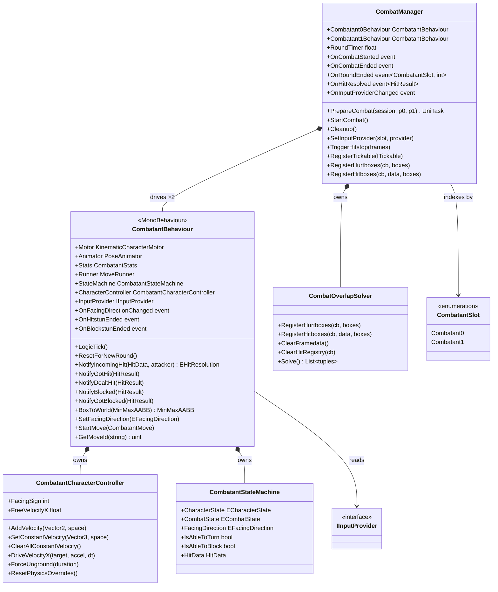

# Combat System

The Combat system owns the lifetime of a single fight: it drives both combatants through the
fixed-rate tick phases, runs KCC physics simulation, resolves hitbox–hurtbox collisions, applies
hitstop, and manages round and match state. It delegates per-combatant logic to
`CombatantBehaviour` and hit resolution to `CombatOverlapSolver`.

See also: [CombatMove.md](CombatMove.md) — move DSL and state machine.  
See also: [CombatHit.md](CombatHit.md) — hit resolution and HitData.

---

## Architecture



The system is split into three layers:

- **Orchestration** (`CombatManager`) — owns the 60 Hz sub-tick loop for both combatants,
  sequences hitstop, collision, KCC physics, the round timer, and round/match transitions. It is
  the only place that can see both combatants simultaneously, so knockback direction resolution
  and all event routing happen here.
- **Entity** (`CombatantBehaviour`) — the per-combatant MonoBehaviour; wires together the move
  runner, state machine, character controller, and pose animator. Its `LogicTick` auto-faces the
  opponent, advances the active move, runs the cancel system, and registers AABB volumes with the
  manager.
- **Physics** (`CombatantCharacterController`) — a KCC `ICharacterController` that composes two
  velocity channels (constant + free) and exposes per-move physics override methods that are
  guaranteed reset on move exit.

---

## Components

### CombatManager

`ITickable<TickManager>` singleton. Its `InputTick` polls each unique input provider once; its
`LogicTick` is the main simulation loop. Registered in `RootInstaller` via Reflex.

**Events**

| Event | Signature | Fires when |
|---|---|---|
| `OnCombatStarted` | `Action<CombatantBehaviour, CombatantBehaviour>` | First `StartCombat` round begins. |
| `OnCombatEnded` | `Action` | Either combatant reaches `_firstToWinRounds` wins. |
| `OnRoundEnded` | `Action<CombatantSlot, int>` | Any round ends; carries the winner and their cumulative win count. |
| `OnHitResolved` | `Action<HitResult>` | Every confirmed hit or block, with full `HitResult`. |
| `OnInputProviderChanged` | `Action<CombatantSlot, IInputProvider>` | An input provider is swapped mid-match. |

**Tick phases inside `LogicTick`** (in order):

1. Drain hitstop — if `_hitstopFramesRemaining > 0`, decrement and return early.
2. Clear per-frame hitbox/hurtbox data and dev visualizer.
3. `Combatant0Behaviour.LogicTick()`, then `Combatant1Behaviour.LogicTick()`.
4. Sub-tickables (dev overlays, camera, etc.).
5. `CombatOverlapSolver.Solve()` → dispatch `NotifyIncomingHit` / `NotifyGotHit` / `NotifyBlocked`.
6. Check for deaths → `RoundEnd` if triggered.
7. KCC `Simulate` (skipped if hitstop was just triggered this frame).
8. Decrement round timer; call `RoundTimeout` if ≤ 0.

**Hitstop** — `TriggerHitstop(frames)` keeps the maximum of the current and the new duration.
A weaker hit landing during a stronger hit's hitstop never cuts it short.

**Match structure**

| Method | Description |
|---|---|
| `PrepareCombat(session, p0, p1)` | Activates the scene, binds combatant behaviours, substitutes CPU for a null/Dummy provider, preloads audio. |
| `StartCombat()` | Flushes input, starts tracking, shows UI, calls `StartRound`, raises `OnCombatStarted`. |
| `Cleanup()` | Nulls combatant references and resets all match counters. Called by `GameManager` after `OnCombatEnded`. |

---

### CombatantBehaviour

`MonoBehaviour, ITickable<CombatManager>`. Lives on each character prefab. Registered for
`CombatManager` sub-ticks automatically; driven by `CombatManager.LogicTick`.

**Key fields**

| Member | Type | Description |
|---|---|---|
| `Motor` | `KinematicCharacterMotor` | KCC motor for movement and grounding. |
| `Animator` | `PoseAnimator` | Applies bone transforms each tick from `CombatantPoseSheet`. |
| `Stats` | `CombatantStats` | Per-instance clone of the move set's `StatsTemplate`. |
| `Runner` | `MoveRunner` | Drives the active move's `Script()` coroutine tick-by-tick. |
| `StateMachine` | `CombatantStateMachine` | Tracks `ECharacterState` × `ECombatState`. |
| `CharacterController` | `CombatantCharacterController` | KCC wrapper; two velocity channels. |
| `InputProvider` | `IInputProvider` | Defaults to `DummyInputProvider`; setting null also falls back. |

**Hit notification methods**

| Method | Called by | Description |
|---|---|---|
| `NotifyIncomingHit(hitData, attacker)` | `CombatManager` | Returns `Hit` or `Blocked` depending on guard state. |
| `NotifyGotHit(result)` | `CombatManager` | Applies damage, hitstun data, victim knockback; starts hitstun move. |
| `NotifyDealtHit(result)` | `CombatManager` | Applies attacker recoil; enables gatling cancel window. |
| `NotifyBlocked(result)` | `CombatManager` | Writes blockstun data, applies victim knockback; starts blockstun move. |
| `NotifyGotBlocked(result)` | `CombatManager` | Applies attacker recoil; notifies runner the attack was blocked. |

**`BoxToWorld(MinMaxAABB)`** — transforms a character-local AABB to world space by enumerating all
8 corners, applying `directionIndicatorRoot` scale and rotation, then computing the new
axis-aligned enclosure. Required because facing-flip is done by root rotation, not a simple sign flip.

---

### CombatantCharacterController

KCC `ICharacterController`. Two velocity channels:

- **Constant** (`SetConstantVelocity` / `ClearConstantVelocity`) — physics-immune; move-driven
  walking speed that is not affected by gravity or friction. Clears automatically when
  `ClearAllConstantVelocity()` is called on move exit.
- **Free** (`AddVelocity`) — accumulates gravity and friction; used for knockback, jump arcs, and
  dash impulses.

**Physics override methods** — all reset to their defaults by `ResetPhysicsOverrides()`:

| Method | Default | Description |
|---|---|---|
| `SetGravityScale(float)` | 1.0 | Scales gravity applied each tick. |
| `SetFrictionScale(float)` | 1.0 | Scales friction applied each tick. |
| `SetIgnoreGravity(bool)` | false | Disables gravity entirely. |
| `SetIgnoreFriction(bool)` | false | Disables friction entirely. |

`ResetPhysicsOverrides()` must be called on every move exit to prevent state from leaking between moves. `CombatantMove.OnMoveExit` is the expected call site.

---

### CombatantStateMachine

Holds all mutable round-local state. No logic — only typed mutators and read properties.

| Property | Type | Description |
|---|---|---|
| `CharacterState` | `ECharacterState` | Standing / Crouching / Airborne. |
| `CombatState` | `ECombatState` | Neutral / Startup / Active / Recovery / Hitstun / Blockstun. |
| `FacingDirection` | `EFacingDirection` | Current screen-space facing; kept in sync with `visualRoot`. |
| `IsAbleToTurn` | `bool` | True when standing, neutral, and turning is not suppressed. |
| `IsAbleToBlock` | `bool` | True when Neutral or already in Blockstun. |
| `HitData` | `HitData` | Active hit data set by the current move; cleared on move end. |

---

## Public API

### CombatManager

| Method / Property | Returns | Description |
|---|---|---|
| `PrepareCombat(session, p0, p1)` | `UniTask` | Async; activates scene, wires combatants, preloads audio. |
| `StartCombat()` | `void` | Begins the first round; call after `PrepareCombat` awaits. |
| `Cleanup()` | `void` | Resets all match state; call after `OnCombatEnded`. |
| `SetInputProvider(slot, provider)` | `void` | Swaps one combatant's input source mid-match. |
| `TriggerHitstop(frames)` | `void` | Freezes simulation for at least `frames` ticks. |
| `RegisterTickable(tickable)` | `void` | Adds a `ITickable<CombatManager>` to the sub-tick list. |
| `UnregisterTickable(tickable)` | `void` | Removes a sub-tickable. |
| `RegisterHurtboxes(cb, boxes)` | `void` | Called by combatants each tick to submit AABB volumes. |
| `RegisterHitboxes(cb, data, boxes)` | `void` | Called by combatants when in Active state to submit hitbox volumes. |
| `RoundTimer` | `float` | Seconds remaining in the current round. |

### CombatantBehaviour

| Method | Returns | Description |
|---|---|---|
| `ResetForNewRound()` | `void` | Restores full HP, resets state machine and runner. |
| `StartMove(CombatantMove)` | `void` | Programmatically starts a move (hitstun, blockstun, throws). |
| `SetFacingDirection(dir)` | `void` | Updates state machine, visual root, and fires `OnFacingDirectionChanged`. |
| `GetMoveId(string)` | `uint` | Lazy ID registry lookup by type name. Returns 0 on miss. |
| `GetMoveById(uint)` | `CombatantMove?` | Returns the move instance registered under the given ID. |
| `BoxToWorld(MinMaxAABB)` | `MinMaxAABB` | Converts a local-space AABB to world space, accounting for facing rotation. |

---

## Usage

```csharp
// Full match lifecycle — driven by GameManager:
await _combatManager.PrepareCombat(session, player0Provider, player1Provider);
_combatManager.StartCombat();
// ... combat runs until OnCombatEnded fires ...
await session.DisposeAsync();
_combatManager.Cleanup();

// Swap CPU for a real player mid-match (dev console):
_combatManager.SetInputProvider(CombatantSlot.Combatant1, realPlayerProvider);

// Register a dev overlay for sub-ticks:
_combatManager.RegisterTickable(myOverlay);
// Always pair with:
_combatManager.UnregisterTickable(myOverlay);
```

---

## Constraints

- `PrepareCombat` must be awaited before calling `StartCombat`. `GameManager.BeginCombat`
  enforces this; do not call `StartCombat` manually from other code.
- `CombatManager.LogicTick` skips all combatant and KCC logic while hitstop is active. Systems
  that need to run during hitstop (camera shake, real-time UI) must not be sub-tickables.
- KCC `Simulate` is called after hitbox–hurtbox resolution each tick. If hitstop is triggered on
  the same tick a hit lands, `Simulate` is skipped for that tick to avoid applying knockback
  physics before hitstop expires.
- `Cleanup` must be called after `DisposeAsync` on the `CombatSession` to avoid dangling combatant
  references from the previous session.
- `CombatantBehaviour.InputProvider` falls back to `DummyInputProvider` when set to null — it is
  never null after construction.
- `ResetPhysicsOverrides` must be called in `CombatantMove.OnMoveExit` for any move that sets
  gravity/friction overrides. Failing to do so leaks physics state into the next move.
