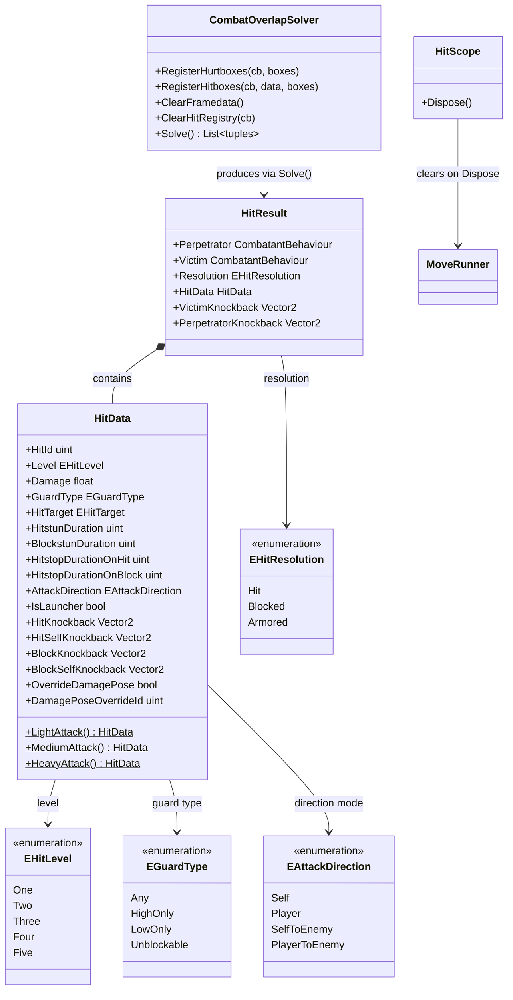

# CombatHit — Hit Resolution

Part of [Combat.md](Combat.md).

This document covers all types involved in hit and block resolution: the `HitData` authored by
move scripts, the `HitResult` produced by `CombatManager`, the `CombatOverlapSolver` that
detects collisions, and the full sequence from overlap detection to stun entry.

---

## Architecture



---

## Components

### HitData

Value struct authored entirely in `CombatantMove.Script()`. Set via `SetHitData(HitData)` or the
`Hit(HitData)` DSL helper. All fields have default zero/false values; use the static factory
methods for sensible starting points.

**Timing fields**

| Field | Type | Description |
|---|---|---|
| `HitstunDuration` | `uint` | Ticks of hitstun applied to the victim on hit. |
| `BlockstunDuration` | `uint` | Ticks of blockstun applied to the victim on block. |
| `HitstopDurationOnHit` | `uint` | Ticks of global gameplay freeze when the hit connects. |
| `HitstopDurationOnBlock` | `uint` | Ticks of global freeze when the hit is blocked. |

**Damage and level fields**

| Field | Type | Description |
|---|---|---|
| `Level` | `EHitLevel` | Tier 1–5; drives damage pose selection and clash resolution. |
| `Damage` | `float` | Raw damage before any scaling. |
| `GuardType` | `EGuardType` | Any, HighOnly, LowOnly, or Unblockable. |
| `HitTarget` | `EHitTarget` | Enemy, Ally, or Any; restricts which combatants the hitbox interacts with. |

**Knockback fields**

| Field | Type | Description |
|---|---|---|
| `AttackDirection` | `EAttackDirection` | Determines how X knockback maps to world space (see table below). |
| `IsLauncher` | `bool` | If true, `ForceUnground` is called on the victim, enabling aerial combos. |
| `HitKnockback` | `Vector2` | Knockback applied to the victim on hit (X resolved by `AttackDirection` at runtime). |
| `HitSelfKnockback` | `Vector2` | Recoil applied to the attacker on hit (in character space). |
| `BlockKnockback` | `Vector2` | Knockback applied to the victim on block. |
| `BlockSelfKnockback` | `Vector2` | Pushback applied to the attacker on block. |

**`EAttackDirection` — knockback X direction resolution:**

| Value | X sign source |
|---|---|
| `Self` | Attacker's facing sign |
| `Player` | Defender's facing sign |
| `SelfToEnemy` | +1 if defender is to the right of attacker, −1 otherwise |
| `PlayerToEnemy` | +1 if attacker is to the right of defender, −1 otherwise |

**Damage pose fields**

| Field | Type | Description |
|---|---|---|
| `OverrideDamagePose` | `bool` | When true, `DamagePoseOverrideId` is used instead of the level-based damage pose. |
| `DamagePoseOverrideId` | `uint` | Global pose ID (`collectionId * 100 + poseId`) for the override. |

**Static factory methods (convenient starting points):**

| Method | Level | Damage | Hitstun | Blockstun | Hitstop (hit/block) |
|---|---|---|---|---|---|
| `HitData.LightAttack()` | 1 | 20 | 9 | 5 | 5 / 2 |
| `HitData.MediumAttack()` | 2 | 35 | 16 | 8 | 7 / 4 |
| `HitData.HeavyAttack()` | 3 | 50 | 25 | 12 | 12 / 8 |

---

### HitResult

Produced by `CombatManager.LogicTick` after every resolved collision. Bundles both combatants,
the outcome, the original `HitData`, and pre-computed world-space knockback vectors.

| Field | Type | Description |
|---|---|---|
| `Perpetrator` | `CombatantBehaviour` | The combatant whose hitbox triggered the collision. |
| `Victim` | `CombatantBehaviour` | The combatant whose hurtbox was overlapped. |
| `Resolution` | `EHitResolution` | `Hit`, `Blocked`, or `Armored`. |
| `HitData` | `HitData` | The original hit data from the attacker's move script. |
| `VictimKnockback` | `Vector2` | World-space knockback pre-resolved for the victim. |
| `PerpetratorKnockback` | `Vector2` | World-space recoil pre-resolved for the attacker. |

Knockback vectors are resolved by `CombatManager.ResolveKnockback` using `AttackDirection` and
both combatants' facing signs, so `CombatantBehaviour.NotifyGotHit` can apply the vector
directly with `AddVelocity`.

---

### HitScope

Disposable returned by the `Hit(HitData)` DSL helper. Clears the state machine's active
`HitData` when the `using` block exits, preventing stale hit data from persisting into the next pose.

```csharp
using (Hit(HitData.MediumAttack()))
{
    BeginActiveState();
    yield return Pose(501, 5); // hit data is live here
}
// HitScope.Dispose() clears hit data here
BeginRecoveryState();
```

---

### CombatOverlapSolver

Stateless per-tick overlap resolver. `CombatantBehaviour.LogicTick` registers volumes; 
`CombatManager.LogicTick` calls `Solve()` after all combatant ticks complete.

| Method | Description |
|---|---|
| `RegisterHurtboxes(cb, boxes)` | Stores hurtbox AABB volumes for the tick (overwrites any prior registration for the same combatant). |
| `RegisterHitboxes(cb, data, boxes)` | Stores hitbox volumes and their `HitData` for the tick. |
| `ClearFramedata()` | Clears all volume registrations. Call at the start of each logic tick. |
| `ClearHitRegistry(cb)` | Removes all hit-registry entries for `cb`. Called by `CombatManager` when a combatant starts a new move. |
| `Solve()` | Performs N×M AABB intersection, deduplicates, and returns `(defender, hitData, attacker)` tuples. |

**Deduplication** — each `(attacker, HitData.HitId, defender)` triple is stored in a `HashSet`.
A hit with the same `HitId` is rejected until the attacker starts a new move. `HitId` 0 bypasses
deduplication (legacy safety net — always assign a `HitId` when using the DSL).

---

## Hit Resolution Flow

The full sequence from overlap to stun, per resolved collision:

```
1. CombatantBehaviour.LogicTick
       → RegisterHurtboxes(this, worldHurtboxes)
       → RegisterHitboxes(this, stateMachine.HitData, worldHitboxes)  [only when Active]

2. CombatManager.LogicTick
       → CombatOverlapSolver.Solve()
           - N×M AABB intersection
           - deduplication via hit registry
           - returns (defender, hitData, attacker) tuples

3. For each collision tuple:
       → defender.NotifyIncomingHit(hitData, attacker)
           - checks IsAbleToBlock && holding back
           - returns Hit or Blocked
       → build HitResult with Resolution, pre-resolve knockback via ResolveKnockback

4. On EHitResolution.Hit:
       → defender.NotifyGotHit(result)
           - ApplyDamage, write hitstun/level into stats
           - ForceUnground if IsLauncher
           - AddVelocity(VictimKnockback)
           - StartMove(cmnActHitstun)
       → attacker.NotifyDealtHit(result)
           - AddVelocity(PerpetratorKnockback)
           - runner.NotifyDealtHit() → HitConfirmed = true
       → TriggerHitstop(hitData.HitstopDurationOnHit)

5. On EHitResolution.Blocked:
       → defender.NotifyBlocked(result)
           - write blockstun/level into stats
           - AddVelocity(VictimKnockback)
           - StartMove(cmnActBlockstun)
       → attacker.NotifyGotBlocked(result)
           - AddVelocity(PerpetratorKnockback)
           - runner.NotifyGotBlocked() → HitConfirmed = true
       → TriggerHitstop(hitData.HitstopDurationOnBlock)

6. OnHitResolved event fired with complete HitResult.
```

---

## Public API

### HitData

| Method / Field | Type | Description |
|---|---|---|
| `HitId` | `uint` | Set by the `Hit()` DSL; identifies this hitbox instance for deduplication. |
| `LightAttack()` | `static HitData` | Pre-configured light attack defaults. |
| `MediumAttack()` | `static HitData` | Pre-configured medium attack defaults. |
| `HeavyAttack()` | `static HitData` | Pre-configured heavy attack defaults. |

### CombatOverlapSolver

| Method | Returns | Description |
|---|---|---|
| `RegisterHurtboxes(cb, boxes)` | `void` | Register this tick's hurtbox volumes. |
| `RegisterHitboxes(cb, data, boxes)` | `void` | Register this tick's hitbox volumes. |
| `ClearFramedata()` | `void` | Reset all per-tick volume data. |
| `ClearHitRegistry(cb)` | `void` | Remove all per-move deduplication entries for `cb`. |
| `Solve()` | `List<(CombatantBehaviour, HitData, CombatantBehaviour)>` | Returns confirmed non-deduplicated overlaps. |

---

## Usage

```csharp
// Authoring HitData in a move script:
protected override IEnumerator Script()
{
    yield return Pose(500, 5); // startup

    // Custom hit data:
    var hitData = HitData.HeavyAttack();
    hitData.IsLauncher = true;
    hitData.HitstunDuration = 30;
    hitData.AttackDirection = EAttackDirection.SelfToEnemy;

    using (Hit(hitData))
    {
        BeginActiveState();
        yield return Pose(501, 6);
    }

    BeginRecoveryState();
    yield return Pose(502, 20);
}

// Reacting to resolved hits in the manager (event subscriber):
_combatManager.OnHitResolved += result =>
{
    if (result.Resolution == EHitResolution.Hit)
        _uiController.ShowHitEffect(result.Victim.transform.position);
};
```

---

## Constraints

- `HitId` must be non-zero for deduplication to work. The `Hit(HitData)` DSL method assigns an
  ID automatically. When setting `HitData` manually via `SetHitData`, assign a unique ID
  explicitly (e.g. from a static counter incremented in `OnInitialize`).
- `CombatOverlapSolver.Solve()` must be called after all `CombatantBehaviour.LogicTick` calls
  complete for the tick. `CombatManager` enforces this ordering.
- `ClearHitRegistry` is called automatically when the attacker starts a new move (wired in
  `CombatManager.StartCombat`). Do not call it manually unless testing.
- `EHitResolution.Armored` is defined but not yet dispatched by `CombatantBehaviour.NotifyIncomingHit`.
  Armor mechanic is a planned extension.
- `EHitTarget.Ally` always returns false from `AreAllies`; no ally relationship is currently
  defined. Only `Enemy` and `Any` produce live collisions.
- Damage pose selection uses the `Level` field: reserved pose collections 50–54 hold damage poses
  for levels 1–5 respectively. `OverrideDamagePose` + `DamagePoseOverrideId` bypass this.
