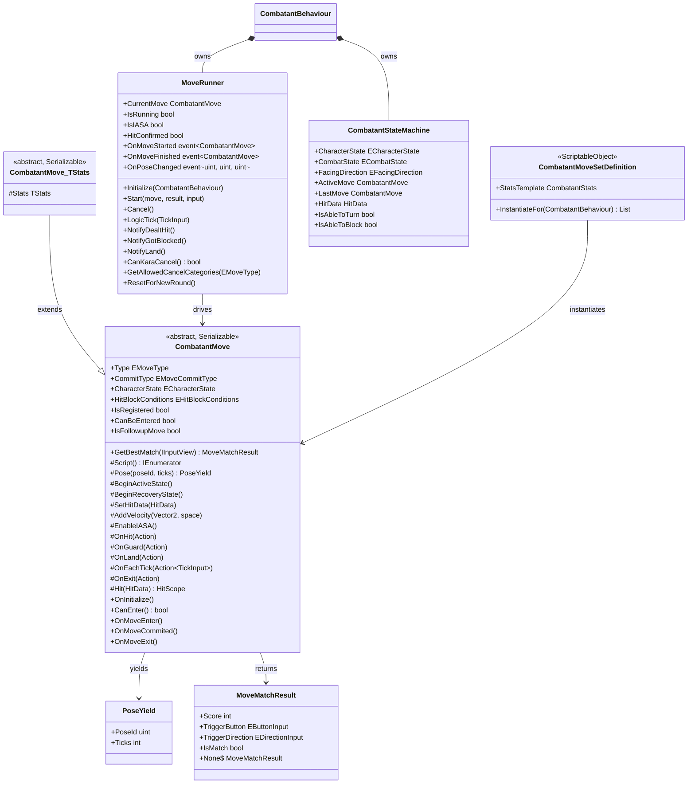

# CombatMove — Move DSL and State Machine

Part of [Combat.md](Combat.md).

This document covers how individual moves are authored (`CombatantMove`, the DSL), how the move
runner drives them tick-by-tick (`MoveRunner`), and the state machine that gates move entry and
cancel windows (`CombatantStateMachine`).

---

## Architecture



---

## Components

### CombatantMove

`[Serializable]` abstract base class. Stored as `[SerializeReference]` entries inside
`CombatantMoveSetDefinition` assets. Each character has one instance per move type at runtime;
instances are cloned via `InstantiateFor` in `Awake` so two combatants of the same character
never share state.

**Move identity** — set in the Inspector (or overridden at runtime via `Override*` methods):

| Property | Type | Description |
|---|---|---|
| `Type` | `EMoveType` | Cancel tier: Movement, Normal, Special, Overdrive. |
| `CommitType` | `EMoveCommitType` | `Active` (subject to cancel rules) or `Neutral` (always preemptible). |
| `CharacterState` | `ECharacterState` | Standing, Crouching, Airborne, or Any. |
| `HitBlockConditions` | `EHitBlockConditions` | Whether hitstun/blockstun blocks entry. |
| `IsRegistered` | `bool` | Virtual; `false` excludes the move from normal candidate pools. |
| `IsFollowupMove` | `bool` | Gatling/whiff-cancel only; never enters via normal move selection. |
| `CanBeEntered` | `bool` | `IsRegistered && CanEnter()`. |

**Override hooks** — called by `MoveRunner` at defined lifecycle points:

| Method | Description |
|---|---|
| `OnInitialize()` | Once after cloning, when `Owner` is available. Use for ID caching and static cancel registration. |
| `CanEnter()` | Extra entry gate beyond state checks (e.g. check a resource). Returns `true` by default. |
| `OnMoveEnter()` | Called when the move starts, before the kara-cancel window closes. |
| `OnMoveCommited()` | Called after the 3-tick kara-cancel window closes. |
| `OnMoveExit()` | Called when the move ends (natural or cancel). Use for guaranteed cleanup, including `ResetPhysicsOverrides`. |

---

### Script() — the Move DSL

`Script()` is the **only** place to define move behaviour. It is an `IEnumerator` coroutine driven
tick-by-tick by `MoveRunner`. The only blocking primitive is `Pose`; everything else executes
instantly at tick transitions.

#### The Blocking Primitive

```csharp
yield return Pose(poseId, ticks);
```

Applies `poseId` from the character's `CombatantPoseSheet` and suspends the coroutine for
`ticks` simulation ticks. Global pose ID = `collectionId * 100 + poseId`.

#### State Transition Helpers (instant)

| Helper | Description |
|---|---|
| `BeginActiveState()` | Transitions `CombatState` to `Active`; hitboxes registered this tick will be live. |
| `BeginRecoveryState()` | Transitions `CombatState` to `Recovery`; hitboxes stop being registered. |

#### Hit Data Helpers (instant)

| Helper | Description |
|---|---|
| `SetHitData(HitData)` | Writes `HitData` into the state machine for this active phase. |
| `Hit(HitData)` | Convenience wrapper — calls `SetHitData` and returns a `HitScope`. Use with `using` to auto-clear hit data on scope exit. |

#### Velocity Helpers (instant)

| Helper | Description |
|---|---|
| `AddVelocity(Vector2, EVelocitySpace)` | Impulse into the free velocity channel. |
| `SetConstantVelocity(Vector3, EVelocitySpace)` | Sets the constant (physics-immune) velocity channel. |
| `ClearAllConstantVelocity()` | Zeroes both constant velocity channels. |

#### Cancel Window Helpers (instant)

| Helper | Description |
|---|---|
| `EnableIASA()` | Opens the IASA (Invincible Action Sequence Availability) window — any combat move can cancel after this point. |

#### Event Handlers (instant, fire during coroutine execution)

| Helper | Description |
|---|---|
| `OnHit(Action)` | Fires when a hit lands this activation. |
| `OnGuard(Action)` | Fires when the attack is blocked this activation. |
| `OnHitOrGuard(Action)` | Registers the handler for both hit and block. |
| `OnLand(Action)` | Fires when the character touches the ground. |
| `OnEachTick(Action<TickInput>)` | Fires every tick while the move is active. |
| `OnExit(Action)` | Fires when the move ends for any reason (including cancels). |

#### Cancel Registration Helpers (instant)

| Helper | Description |
|---|---|
| `AddStaticGatlingOption(uint moveId)` | Registers a permanent gatling target in `OnInitialize`. |
| `AddStaticWhiffCancelOption(uint moveId)` | Registers a permanent whiff-cancel target in `OnInitialize`. |
| `AddDynamicGatlingOption(uint moveId)` | Registers a per-activation gatling target; cleared on exit. |
| `AddDynamicWhiffCancelOption(uint moveId)` | Registers a per-activation whiff-cancel target; cleared on exit. |

**Canonical move skeleton:**

```csharp
protected override IEnumerator Script()
{
    // 1. Startup
    yield return Pose(500, 4); // 4 ticks startup

    // 2. Active
    SetHitData(HitData.LightAttack());
    BeginActiveState();
    yield return Pose(501, 3); // 3 active frames
    BeginRecoveryState();

    // 3. Recovery
    yield return Pose(502, 8); // 8 recovery frames
}
```

---

### CombatantMove\<TStats\>

Generic subclass for moves that need character-specific stats. Exposes `Stats` (the
`TStats`-typed instance cast from `Owner.Stats`) so the move can read or modify HP, counters,
and special-character flags without unsafe casts.

```csharp
// Character-specific move:
[Serializable]
public class RDRForwardDash : CombatantMove<RDRCombatantStats>
{
    protected override IEnumerator Script()
    {
        if (!Stats.CanTakeAirMovementAct) yield break;
        Stats.UseAirMovementAction();
        // ...
    }
}
```

---

### MoveRunner

Drives the active move's `Script()` coroutine one tick at a time. Owned by `CombatantBehaviour`.

| Member | Description |
|---|---|
| `CurrentMove` | The move whose coroutine is currently running; null between moves. |
| `IsRunning` | True while a coroutine is active. |
| `IsIASA` | True after the move called `EnableIASA()`. |
| `HitConfirmed` | True for the tick in which a hit or block was landed; enables gatling cancel checks. |
| `OnMoveStarted` | Raised when a move starts. |
| `OnMoveFinished` | Raised when a move ends (natural or cancel). |
| `OnPoseChanged` | Raised each time `yield return Pose(...)` advances, with `(globalId, collectionId, poseId)`. |

**Methods**

| Method | Description |
|---|---|
| `Start(move, result, input)` | Begins a new move's coroutine. Never call while `IsRunning` — cancel first. |
| `Cancel()` | Immediately stops the current coroutine, fires `OnExit` handlers, clears dynamic state. |
| `LogicTick(TickInput)` | Advances the coroutine by one tick. Called by `CombatantBehaviour.LogicTick`. |
| `NotifyDealtHit()` | Sets `HitConfirmed` and invokes `OnHit` handlers. |
| `NotifyGotBlocked()` | Sets `HitConfirmed` and invokes `OnGuard` handlers. |
| `NotifyLand()` | Invokes `OnLand` handlers. |
| `CanKaraCancel()` | True during the first 3 ticks of an Active-commit move. |
| `GetAllowedCancelCategories(type)` | Returns the move tiers reachable via gatling from `type` (Normal → Special → Overdrive). |
| `ResetForNewRound()` | Cancels any running move and clears all runner state. |
| `ClearHitData()` | Clears the state machine's `HitData`; called by `HitScope.Dispose()`. |

---

### Cancel Priority Ladder

The cancel system is evaluated every tick by `CombatantBehaviour.TryCancel` in strict order:

| Priority | Name | Condition | Pool |
|---|---|---|---|
| 1 | **Neutral commit** | Active move has `CommitType == Neutral` | Any combat or different common move |
| 2 | **Kara-cancel** | `CanKaraCancel()` — ticks 0–2 of an Active move | Same tier or higher; not Overdrive→Overdrive |
| 3 | **IASA** | `IsIASA == true` | Any combat move |
| 4 | **Gatling** | `HitConfirmed == true` (one tick) | Explicit whitelist + category ladder (Normal→Special→Overdrive) |
| 5 | **Whiff cancel** | `CombatState == Recovery && !HitConfirmed` | Explicit per-move whitelist only |

Candidate sets are populated into a pre-allocated scratch list and scored by `MoveInputEntry.Specificity`.
The highest-scoring candidate that passes all entry gates wins.

---

### CombatantStateMachine

Tracks all per-round mutable state in one place. No logic — callers transition through typed
mutators (`SetCombat`, `SetPhysical`, `OnGotHit`, `OnBlocked`, `OnLanded`, etc.).

**State cross-product** — a combatant is always in exactly one `ECharacterState` and one
`ECombatState` simultaneously:

| `ECharacterState` | Meaning |
|---|---|
| `Standing` | On the ground, upright. Auto-facing is possible. |
| `Crouching` | On the ground, crouched. Low attack blockstun applies. |
| `Airborne` | Not in contact with the ground. |
| `Any` | Wildcard used only in move definitions, never as a live state. |

| `ECombatState` | Meaning |
|---|---|
| `Neutral` | No active committed move. |
| `Startup` | Active move is in pre-hitbox frames. |
| `Active` | Hitboxes are live. |
| `Recovery` | Hitbox phase ended; character cannot act until the move finishes. |
| `Hitstun` | Received a hit; stunned for `PendingHitstunTicks`. |
| `Blockstun` | Successfully blocked; stunned for `PendingBlockstunTicks`. |

---

## Usage

```csharp
// Minimal attacking move:
[Serializable]
public class RDRStandLight : CombatantMove
{
    protected override void OnInitialize()
    {
        // Cache IDs for gatling targets
        AddStaticGatlingOption(Owner.GetMoveId(nameof(RDRStandMedium)));
    }

    protected override IEnumerator Script()
    {
        yield return Pose(100, 5); // startup

        using (Hit(HitData.LightAttack()))
        {
            BeginActiveState();
            yield return Pose(101, 3); // active
        }

        BeginRecoveryState();
        EnableIASA(); // allow any move during recovery
        yield return Pose(102, 12); // recovery
    }
}
```

---

## Constraints

- `Script()` is the **only** location for move behaviour. Do not call DSL helpers from
  `OnMoveEnter`, `OnMoveExit`, or `OnInitialize` — they execute outside the coroutine's tick
  context and will break hitstop and state sequencing.
- `yield return Pose(id, ticks)` is the only blocking statement. Never use `yield return null`
  or any other yield type; `MoveRunner` checks for `PoseYield` specifically.
- `BeginActiveState()` must be called before the pose that first activates hitboxes. Hitboxes are
  registered by `CombatantBehaviour.LogicTick` only when `CombatState == Active`.
- `ResetPhysicsOverrides()` must be called from `OnMoveExit` for any move that overrides gravity,
  friction, or uses `IgnoreGravity` / `IgnoreFriction`. Missing this causes state to leak.
- Static cancel registrations (`AddStaticGatlingOption`, `AddStaticWhiffCancelOption`) belong in
  `OnInitialize`. Dynamic registrations inside `Script()` are cleared on exit automatically.
- `HitConfirmed` is true for exactly one tick per hit — the tick `CombatManager` resolved the
  collision. Gatling cancel checks must happen in the same `LogicTick` pass.
- Pose global ID = `collectionId * 100 + poseId`. Reserved collections: 50–54 (damage poses per
  level 1–5), 55–59 (block poses per level 1–5).
