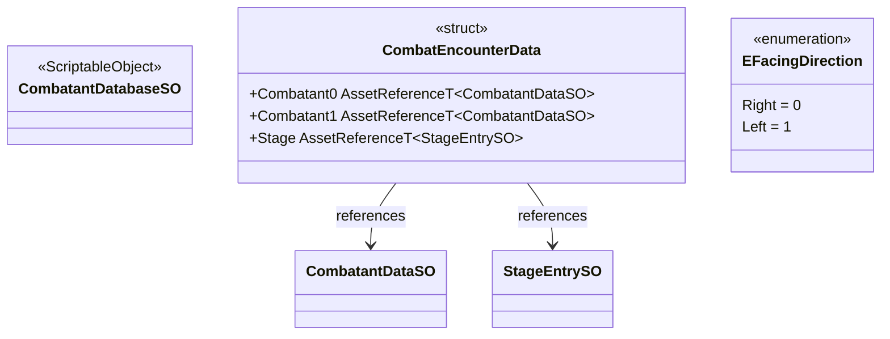

# Common System

The Common system holds shared contracts and data assets used across multiple systems without
creating circular dependencies. It defines the `CombatEncounterData` struct that `GameManager`
accepts to start a match, the `EFacingDirection` enum used throughout combat and input, and the
`CombatantDatabaseSO` registry of all playable characters.

---

## Architecture



---

## Components

### CombatEncounterData

Lightweight `struct` that bundles the three Addressable references needed to start one match.
Built by the `CombatantSelectScreen` when the player locks in choices; passed to
`GameManager.BeginCombat`, which forwards it to `CombatSession.LoadAsync`.

| Field | Type | Description |
|---|---|---|
| `Combatant0` | `AssetReferenceT<CombatantDataSO>` | Addressable reference to the first combatant's data asset. |
| `Combatant1` | `AssetReferenceT<CombatantDataSO>` | Addressable reference to the second combatant's data asset. |
| `Stage` | `AssetReferenceT<StageEntrySO>` | Addressable reference to the chosen stage. |

---

### EFacingDirection

Enum describing a combatant's horizontal orientation in **world space** (screen-space, not
character-space). Used by `CombatantStateMachine`, `CombatantCharacterController`, and
`CharacterInputView` to convert directions between world space and character space.

| Value | Numeric | Meaning |
|---|---|---|
| `Right` | 0 | Facing the positive X axis (screen right). |
| `Left` | 1 | Facing the negative X axis (screen left). |

`CharacterInputView` checks this value at read time to flip horizontal direction bits.
`CombatantCharacterController.FacingSign` derives `+1` or `−1` from it.

---

### CombatantDatabaseSO

`ScriptableObject` registry of all playable combatants. Currently a structural placeholder;
the selection UI and any future character-unlock system will read entries from this asset.

Create via: **Unwind Database → Combatant Database**

---

## Usage

```csharp
// Building a CombatEncounterData and starting a match:
var encounter = new CombatEncounterData
{
    Combatant0 = _selectedCombatant0.combatantDataReference,
    Combatant1 = _selectedCombatant1.combatantDataReference,
    Stage      = _selectedStage.stageEntryReference,
};
await _gameManager.BeginCombat(encounter, p0InputProvider, p1InputProvider);

// EFacingDirection usage in CombatantCharacterController:
CharacterController.FacingSign = direction == EFacingDirection.Right ? 1 : -1;

// EFacingDirection usage in CharacterInputView:
var view = new CharacterInputView(buffer, EFacingDirection.Left);
// view.GetFrame(0) now has Input6 == "toward opponent" for a left-facing character
```

---

## Constraints

- `CombatEncounterData` is a value type (`struct`); copy semantics apply. Do not hold
  references to it expecting the source to mutate the copy.
- All three `AssetReference` fields must be valid Addressable references. `CombatSession.LoadAsync`
  awaits all three in parallel and will fail silently (null combatant or stage) if any are empty.
- `EFacingDirection.Right = 0` is the default value for uninitialized variables. Ensure
  explicit assignment when the initial facing is not guaranteed to be `Right`.
