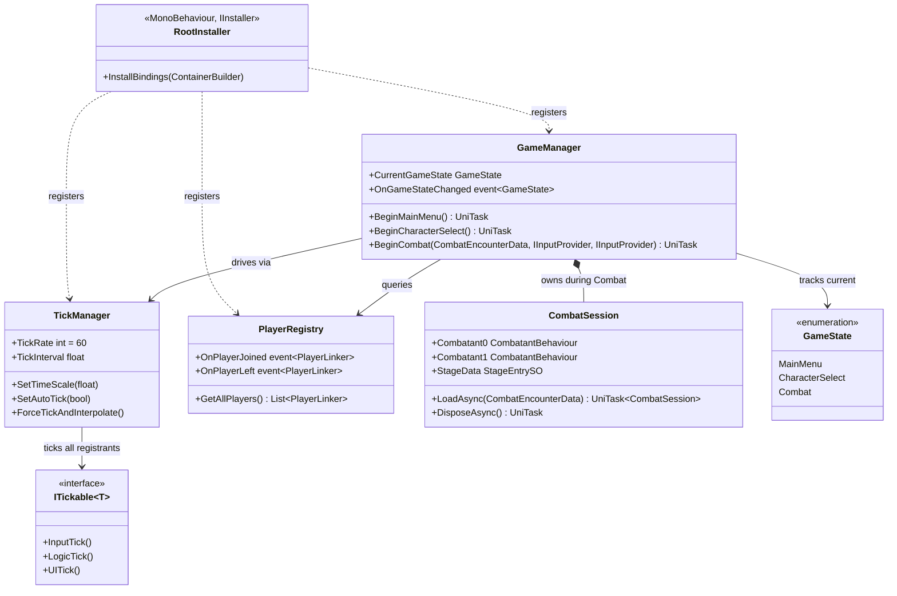

# Core System

The Core system is the composition root and runtime host of Project Unwind. It owns the top-level
game-state machine, the fixed-rate tick loop, player join/leave tracking, and the Addressables
session that loads each combat encounter. All other systems are registered here via Reflex and
receive their dependencies through constructor injection.

---

## Architecture



The Core system has three concerns that are cleanly separated:

- **State machine** (`GameManager`) — decides which phase the game is in and orchestrates
  the transitions between them. It does not tick anything directly; it delegates to `CombatManager`
  and `UIManager`.
- **Tick loop** (`TickManager`) — drives every `ITickable<TickManager>` at 60 Hz in strict phase
  order, independent of Unity's frame rate.
- **Session lifecycle** (`CombatSession`) — isolates the Addressables lifetime of one match so
  that `GameManager` does not hold raw handles.

`RootInstaller` is the only place where singletons are wired together. Nothing outside it calls
`new` on a managed service.

---

## Components

### GameState

Top-level game phase. `GameManager` transitions through these in order; going backwards
(e.g. Combat → MainMenu after a match) is normal.

| Value | Meaning |
|---|---|
| `MainMenu` | Title screen is active. Menu playlist running. |
| `CharacterSelect` | Combatant and stage selection screen is active. Menu playlist running. |
| `Combat` | A combat round is in progress. Combat playlist running. |

---

### GameManager

Top-level state machine. Owns the `CombatSession` lifetime, orchestrates audio playlist switches
at each state boundary, and routes UI screen transitions through `UIManager`. Constructed once by
Reflex; never instantiated directly.

**Events**

| Event | Signature | Fires when |
|---|---|---|
| `OnGameStateChanged` | `Action<GameState>` | `CurrentGameState` changes, immediately after the field is updated |

**State transitions**

| Method | Transitions to | Description |
|---|---|---|
| `BeginMainMenu()` | `MainMenu` | Activates menu playlist, wires main menu events, shows main menu screen via fade. Called automatically by the constructor. |
| `BeginCharacterSelect()` | `CharacterSelect` | Activates menu playlist, wires `OnEncounterReady`, shows character select screen via fade. |
| `BeginCombat(encounterData, p0, p1)` | `Combat` | Fades to black, loads `CombatSession`, prepares and starts combat, activates combat playlist, fades back in. |

`BeginCombat` calls `CombatSession.LoadAsync` and then `CombatManager.PrepareCombat` before
raising `OnGameStateChanged`, so all downstream subscribers see the state as `Combat` only after
the session is fully ready.

**Quit behaviour** — `HandleQuitRequested` exits differently per platform:
- Editor: stops play mode
- WebGL: redirects to the project page
- Standalone: `Application.Quit()`

---

### TickManager

MonoBehaviour on the `GlobalSystems` prefab. Drives a fixed-rate 60 Hz loop independent of Unity's
frame rate by accumulating `Time.deltaTime` in `Update` and draining whole tick intervals.

**Constants**

| Member | Value | Description |
|---|---|---|
| `TickRate` | `60` | Simulation ticks per second. |
| `TickInterval` | `1/60 ≈ 0.01667 s` | Duration of one tick. |

**Phase order per tick** — executed in strict sequence, never interleaved:

```
InputTick  → all ITickable<TickManager> registrants
LogicTick  → all ITickable<TickManager> registrants
UITick     → all ITickable<TickManager> registrants
Interpolate(alpha) → all IInterpolatable registrants
```

**Public API**

| Method | Description |
|---|---|
| `SetTimeScale(float)` | Scales delta time before accumulation. `1.0` = real time; values below `1.0` slow the simulation (used for hitstop). |
| `SetAutoTick(bool)` | When `false`, automatic ticking from `Update` is suspended. Use `ForceTickAndInterpolate` to advance manually. |
| `ForceTickAndInterpolate()` | Fires one complete tick then interpolates to `alpha = 1`. No-op when auto-tick is enabled. |

---

### ITickable\<T\>

```csharp
public interface ITickable<T>
{
    void InputTick()  { }
    void LogicTick()  { }
    void UITick()     { }
}
```

The generic parameter `T` identifies the owner that calls the tick — it does not constrain
behaviour. `ITickable<TickManager>` is ticked directly by `TickManager`; `ITickable<CombatManager>`
is sub-ticked by `CombatManager` inside its own `LogicTick`. All three phase methods have default
no-op implementations, so implementors override only the phases they need.

---

### RootInstaller

`MonoBehaviour, IInstaller` on the scene root. `InstallBindings` is called once by Reflex at scene
load and must not be called manually.

**Registered singletons (in bind order)**

| Type | Interfaces | Resolution |
|---|---|---|
| `KCCSettings` (value) | — | Eager |
| `AudioSettings` (value) | — | Eager |
| `MusicSettings` (value) | — | Eager |
| `UISettings` (value) | — | Eager |
| `GameManager` | `IDisposable` | Eager |
| `CombatManager` | `ITickable<TickManager>` | Eager |
| `PlayerRegistry` | `IDisposable` | Eager |
| `UIManager` | `IDisposable` | Eager |
| `MainMenuScreen` | `IDisposable` | Eager |
| `CombatantSelectScreen` | — | Eager |
| `AudioManager` | `IDisposable` | Eager |
| `MusicManager` | `IDisposable` | Eager |
| `LanguageSystem` | — | Eager |
| `VoicelineManager` | `IDisposable` | Eager |

`UISettings` is optional: if the Inspector field is unassigned, a default `ScriptableObject`
instance is created and a warning is logged.

`PostBuildInjection` is called by `GameInitializer` (not `RootInstaller`) for MonoBehaviours that
cannot use constructor injection (`TickManager`, `InputHistoryUIList`, `CombatCamera`, `CombatUIController`).

---

### PlayerRegistry

Tracks at most two `PlayerLinker` instances (index 0 and 1) attached to Unity `PlayerInput` components.
Subscribes to `PlayerInputManager.onPlayerJoined/onPlayerLeft` on construction; unsubscribes on `Dispose`.

| Member | Description |
|---|---|
| `OnPlayerJoined` | Raised after the joining player's linker is slotted. |
| `OnPlayerLeft` | Raised after the departing player's slot is cleared. |
| `GetAllPlayers()` | Returns a list of occupied slots in join order (always ≤ 2 elements). |

---

### CombatSession

Manages the Addressable lifetime of one combat encounter. Always create via `LoadAsync`; never
call `new` directly. Holds six Addressable handles alive for the session duration to prevent
the loaded assets from being garbage collected.

**Load sequence**

1. Load `StageEntrySO`, `CombatantDataSO ×2` in parallel.
2. Load stage scene (additive, `activateOnLoad: false`) and instantiate both combatant prefabs in parallel.
3. Report combined progress to `onProgress` callback.

```csharp
var session = await CombatSession.LoadAsync(encounterData, p => Debug.Log($"{p:P0}"));
await session.ActivateSceneAsync(); // makes stage visible
// ... combat runs ...
await session.DisposeAsync();      // releases all handles
```

**Properties**

| Property | Type | Description |
|---|---|---|
| `Combatant0` | `CombatantBehaviour` | Resolved from the instantiated combatant 0 prefab. |
| `Combatant1` | `CombatantBehaviour` | Resolved from the instantiated combatant 1 prefab. |
| `Combatant0Data` | `CombatantDataSO` | Loaded data asset for combatant 0. |
| `Combatant1Data` | `CombatantDataSO` | Loaded data asset for combatant 1. |
| `StageData` | `StageEntrySO` | Loaded stage entry; used for spawn marker lookup. |

---

## Usage

```csharp
// Normal flow — driven entirely by GameManager events:
//   Constructor → BeginMainMenu()
//   MainMenuScreen.OnPlayRequested → BeginCharacterSelect()
//   CombatantSelectScreen.OnEncounterReady → BeginCombat(...)
//   CombatManager.OnCombatEnded → BeginMainMenu()

// Dev console / testing — call directly:
await _gameManager.BeginCharacterSelect();
await _gameManager.BeginCombat(encounterData, player0Provider, cpuProvider);

// Tick control (dev console):
_tickManager.SetTimeScale(0.25f); // quarter speed
_tickManager.SetAutoTick(false);
_tickManager.ForceTickAndInterpolate(); // single-step
```

---

## Constraints

- `TickManager` phases fire in strict order: `InputTick → LogicTick → UITick`. Never invoke a later
  phase from within an earlier one on the same tick.
- `CombatSession.LoadAsync` must complete before `CombatManager.PrepareCombat` is called.
  `BeginCombat` enforces this internally — do not call `PrepareCombat` manually.
- `PlayerRegistry` supports at most two simultaneous players. A third join logs an error and is ignored.
- `ITickable<T>` phase methods all have default no-op implementations. Overriding only the phases
  needed is correct; do not call `base.InputTick()` etc. unless you need the default behaviour.
- All singletons registered in `RootInstaller` are eager — they are constructed at scene load even
  if nothing has requested them yet. Do not add a singleton here unless it is always needed.
- `BeginCombat` must be awaited before calling `CombatManager.StartCombat`. `GameManager`
  handles this; if calling `BeginCombat` directly (e.g. from the dev console), the awaited pattern is required.
