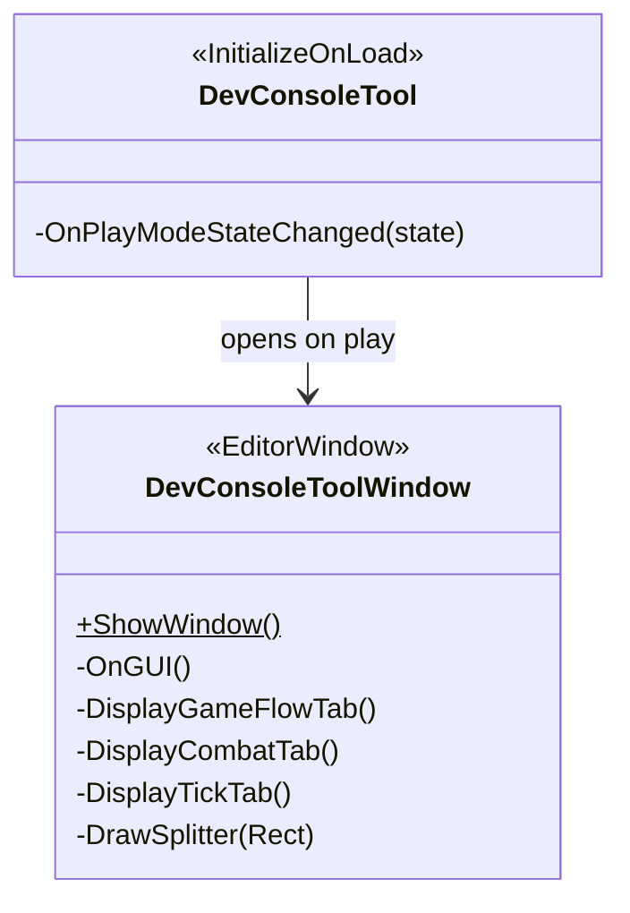

# Dev System

The Dev system provides an in-editor console for controlling the running game from the Unity
Editor without touching the game's play-mode UI. It auto-opens on play-mode entry and exposes
three panels: Game Flow (drive state transitions), Combat (swap input providers, toggle debug
overlays), and Tick (time scale, manual stepping). The system has no runtime footprint — it is
entirely `#if UNITY_EDITOR`.

---

## Architecture

---

## Components

### DevConsoleTool

`[InitializeOnLoad]` static class. Its static constructor subscribes to
`EditorApplication.playModeStateChanged`. When play mode enters (`EnteredPlayMode`),
`DevConsoleToolWindow.ShowWindow()` is called to ensure the window is open.

No runtime objects are created; the class exists solely to register the auto-open hook.

---

### DevConsoleToolWindow

`EditorWindow` opened by `DevConsoleTool`. Not registered in the Reflex container — it injects
itself via `AttributeInjector.Inject` each time play mode is entered, after a brief editor
delay that allows Reflex to finish building its container. An `_injected` flag gates all
gameplay calls to prevent use before injection completes.

**Three panels (rendered every `OnGUI` call):**

**Game Flow tab** — available in all game states:
- **Character Select** button — calls `GameManager.BeginCharacterSelect()`.
- **Custom Combat** foldout — pick `CombatantDataSO` assets for both slots and a stage, then
  click **Start Custom Combat** to call `GameManager.BeginCombat` with the selected assets.

**Combat tab** — enabled only while `GameState == Combat`:
- **Input provider swap** — pick a provider type (Player / CPU / Dummy) for either combatant
  slot and apply it to `CombatManager.SetInputProvider`.
- **Input history toggle** — checkbox that shows or hides the `InputHistoryUIList` visualiser.

**Tick panel** — always visible at the bottom of the window, draggable:
- **Time scale slider** — maps to `TickManager.SetTimeScale(float)`.
- **Auto-tick toggle** — calls `TickManager.SetAutoTick(bool)`.
- **Step** button — calls `TickManager.ForceTickAndInterpolate()`. Active only when auto-tick
  is off.

---

## Public API

### DevConsoleToolWindow

| Method | Description |
|---|---|
| `ShowWindow()` | Opens or focuses the dev console window. Called automatically on play-mode entry. |

All other members are private; the window is driven entirely through its `OnGUI` layout.

---

## Usage

The window opens automatically. To open it manually:

**Window → Dev Console**

The window docks like any other Unity EditorWindow. `_injected` is reset on each play-mode
exit so injection runs again on the next entry — no stale state persists between sessions.

---

## Constraints

- The entire Dev system is wrapped in `#if UNITY_EDITOR`; no symbols or classes are present in
  runtime builds.
- `AttributeInjector.Inject` on the window must complete before any Reflex-injected field is
  used. The `_injected` guard prevents use before injection and is the only safety net — do not
  remove it.
- The window manually subscribes to `EditorApplication.playModeStateChanged` in `OnEnable`
  and unsubscribes in `OnDisable`. Forgetting either causes double-callbacks or dangling
  references across domain reloads.
- `DevConsoleToolWindow` is not in the Reflex container and never will be — it is an
  `EditorWindow`, not a plain C# class, so constructor injection is not available.
