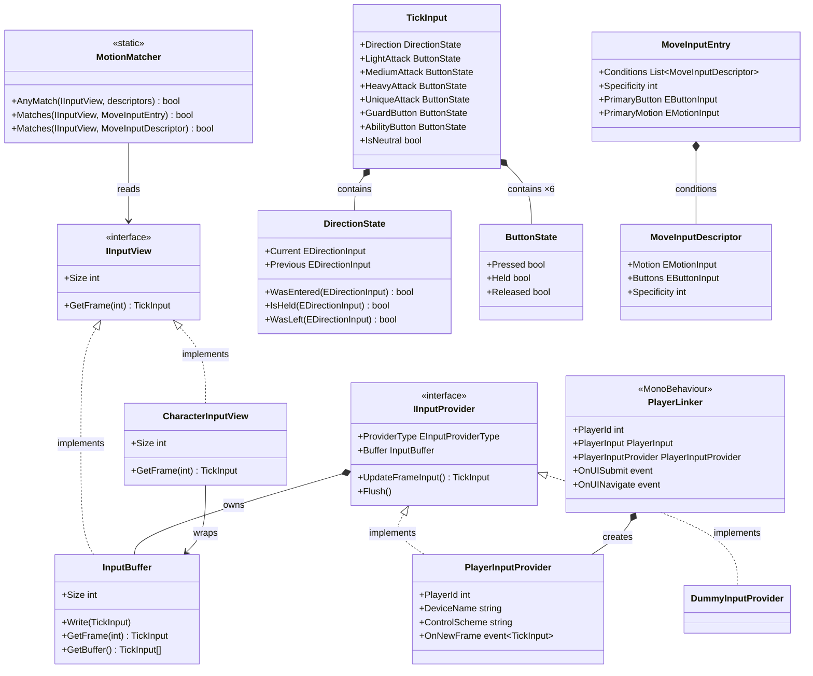

# Input System

The Input system bridges Unity's New Input System to the game's fixed-rate 60 Hz tick loop. It
translates raw device events into per-tick `TickInput` snapshots stored in ring-buffer history,
and provides the motion-matching grammar (`MotionMatcher`) that move definitions use to detect
complex directional sequences. All direction values are always expressed in **character space**
so move code is side-agnostic.

---

## Architecture



The system has three layers:

- **Capture** (`PlayerInputProvider`, `ButtonTracker`) — subscribes to Unity Input System callbacks
  between ticks, latches the strongest directional value and all button edges, then collapses
  everything into a single `TickInput` when `UpdateFrameInput()` is called.
- **History** (`InputBuffer`, `IInputView`, `CharacterInputView`) — a fixed-capacity ring buffer
  stores one `TickInput` per tick. `CharacterInputView` wraps the buffer and flips horizontal
  directions at read time based on the character's current facing.
- **Matching** (`MotionMatcher`, `MoveInputEntry`, `MoveInputDescriptor`) — a stateless static
  evaluator that walks the history buffer to check motion sequences and button edges against a
  descriptor tree, returning the first matching alternative.

---

## Numpad Notation

All directions in the system use **numpad notation** in **character space**. Input 6 is always
"toward the opponent" regardless of which side of the screen the character is on. `CharacterInputView`
performs the left/right flip transparently so move code never needs to know the character's
screen position.

```
7  8  9        ↖  ↑  ↗
4  5  6   →   ←  ·  → (toward opponent)
1  2  3        ↙  ↓  ↘
```

| Numpad | Direction |
|---|---|
| 5 | Neutral (no directional input) |
| 6 | Forward — toward opponent |
| 4 | Back — away from opponent |
| 2 | Down |
| 8 | Up |
| 3 | Down-forward |
| 1 | Down-back |
| 9 | Up-forward |
| 7 | Up-back |

---

## Components

### TickInput

Immutable per-tick input snapshot written to `InputBuffer` once per tick. Contains one
`DirectionState` and six `ButtonState` fields — one for each game button.

| Field | Type | Description |
|---|---|---|
| `Direction` | `DirectionState` | Current and previous directional input in character space. |
| `LightAttack` | `ButtonState` | Light attack button state for this tick. |
| `MediumAttack` | `ButtonState` | Medium attack button state. |
| `HeavyAttack` | `ButtonState` | Heavy attack button state. |
| `UniqueAttack` | `ButtonState` | Unique attack (character-specific) button state. |
| `GuardButton` | `ButtonState` | Guard button state. |
| `AbilityButton` | `ButtonState` | Ability button state. |
| `IsNeutral` | `bool` | `true` when direction is 5 and no button is held. |

---

### DirectionState

Two-frame directional snapshot. Stores `Current` and `Previous` so edge detection (just entered,
just left a direction) does not require looking back into the buffer.

| Method | Description |
|---|---|
| `WasEntered(dir)` | `true` if `Current == dir` and `Previous != dir` — the direction was just pressed. |
| `IsHeld(dir)` | `true` if `Current == dir`. |
| `WasLeft(dir)` | `true` if `Previous == dir` and `Current != dir` — the direction was just released. |

`DirectionState` equality compares only `Current`, making it safe to use in switch expressions
that key on the current held direction.

---

### ButtonState

Three-flag struct for one button per tick. All three flags are mutually consistent within a
single tick — `Pressed` and `Released` can never both be true simultaneously.

| Field | Description |
|---|---|
| `Pressed` | `true` only on the first tick the button is down. |
| `Held` | `true` every tick the button is held, including the first. |
| `Released` | `true` only on the first tick the button is up after being held. |

---

### IInputProvider

Contract for any input source. `CombatManager` holds one `IInputProvider` per combatant slot;
the actual type (`PlayerInputProvider`, `DummyInputProvider`, or `CpuInputProvider`) is chosen
at match start by `GameManager`.

| Member | Description |
|---|---|
| `ProviderType` | Identifies the source kind; used for debug display and replay systems. |
| `Buffer` | The `InputBuffer` owned by this provider; holds 2 s of history. |
| `UpdateFrameInput()` | Called once per tick (during `InputTick`). Samples physical input, writes to the buffer, and returns the current `TickInput`. |
| `Flush()` | Drops any buffered physical state accumulated before combat starts. No-op for providers without hardware input. |

---

### PlayerInputProvider

Translates Unity Input System callbacks into `TickInput` snapshots. One `ButtonTracker` per
button latches presses that arrive between ticks so no press is ever dropped even at sub-tick
timing. Direction is accumulated by latching the highest-magnitude value seen since the last tick.

| Member | Description |
|---|---|
| `PlayerId` | Zero-based index from `PlayerInput.playerIndex`. |
| `DeviceName` | Display name of the connected device. |
| `ControlScheme` | Active control scheme name (e.g. `"Gamepad"`). |
| `OnNewFrame` | Raised after each `UpdateFrameInput` write. |
| `UpdateFrameInput()` | Collapses accumulated directional + button state into one `TickInput`, writes to `Buffer`, resets latches. |
| `Flush()` | Resets all `ButtonTracker` instances and the direction latch. Call before the first combat tick. |

---

### DummyInputProvider

Always returns a fully neutral `TickInput` (direction 5, all buttons default). Used to occupy
a combatant slot for testing or when no player or CPU is wired to that slot.

---

### InputBuffer

Fixed-capacity ring buffer that stores `TickInput` frames at 60 Hz. Default capacity is 120
frames (2 seconds). Indexing is always relative to the most recent write: `GetFrame(0)` returns
the current frame, `GetFrame(1)` the previous, and so on.

| Member | Description |
|---|---|
| `Size` | Total frame capacity. |
| `Write(TickInput)` | Advances the write head and stores the frame. Called by `UpdateFrameInput`. |
| `GetFrame(int ticksAgo)` | Returns the frame `ticksAgo` ticks in the past. Returns `default` when the buffer has not yet been written or `ticksAgo >= Size`. |
| `GetBuffer()` | Returns the raw backing array. Use only for serialisation or replay; prefer `GetFrame` for normal access. |

---

### IInputView

Read-only abstraction over a frame buffer. Both `InputBuffer` (world-space) and
`CharacterInputView` (character-space) implement it. `MotionMatcher` accepts `IInputView` so
callers do not need to pass the facing direction separately.

---

### CharacterInputView

A lightweight `readonly struct` wrapper over `InputBuffer` that converts world-space directions
to character space on every `GetFrame` call. When the character faces left, all horizontal
direction bits are mirrored (6↔4, 3↔1, 9↔7). The conversion uses the character's
**current** facing at the time of read, not the facing stored at write time — this is intentional
because facing can change while a move is active.

---

### MotionMatcher

Stateless static evaluator. Reads backward through an `IInputView` to check whether the recent
input history satisfies a `MoveInputDescriptor` or `MoveInputEntry`.

**Matching grammar** — OR of ANDs:

- A move matches when **any** `MoveInputEntry` in its list matches.
- An entry matches when **all** of its `MoveInputDescriptor` conditions match simultaneously.

**Button-anchored evaluation** — when a descriptor requires buttons, `MotionMatcher` first
searches backward up to `ButtonEdgeLeniency` (3) ticks for the button press edge. All motion
checks are then evaluated relative to that anchor frame, not the current tick. This gives a
3-tick forgiveness window so near-simultaneous motion + button inputs are not rejected.

| Method | Description |
|---|---|
| `AnyMatch(buffer, descriptors)` | Returns `true` when any descriptor in the list matches. Shorthand for OR-evaluation over a flat list. |
| `Matches(buffer, MoveInputEntry)` | Returns `true` when all conditions in the entry match (AND clause). |
| `Matches(buffer, MoveInputDescriptor)` | Evaluates one atomic motion+button condition. |

---

### MoveInputDescriptor

Atomic input condition: one `EMotionInput` paired with zero or more `EButtonInput` flags.

| Field | Description |
|---|---|
| `Motion` | The directional sequence required (see table below). |
| `Buttons` | Flag set of buttons that must be simultaneously pressed. `None` means no button is required. |
| `Specificity` | Score used to break ties between overlapping descriptors. Higher = more specific. |

**Specificity scores by motion type:**

| Motion | Example | Score |
|---|---|---|
| `None` | button press only | 0 |
| `Held4/6/2/8` | hold back | 10 |
| `HeldAny*` | hold any-back | 10 |
| `Disallow*` | NOT holding forward | 5 |
| `DoubleTap*` | ←← | 15 |
| `QCF`, `QCB`, `DP`, `RDP` | 236, 214, 623, 421 | 20 |
| `Charge46/64/28/82` | hold ←, release → | 25 |
| `HCF`, `HCB` | 41236, 63214 | 30 |
| `FC` | 360 | 40 |

Each required button adds `+1` to the score, breaking ties between identical motions.

---

### MoveInputEntry

One alternative input sequence — the AND clause of the overall OR(AND) grammar. A move
typically has one entry (e.g. QCF+L), but may have multiple to cover alternate inputs.

| Member | Description |
|---|---|
| `Conditions` | All descriptors that must match simultaneously. |
| `Specificity` | Sum of all descriptor specificities. Compound entries naturally outscore simpler ones. |
| `PrimaryButton` | The first descriptor whose `Buttons` is not `None`. Used to look up the button edge anchor. |
| `PrimaryMotion` | The first positive (non-Disallow, non-None) motion descriptor. Used for direction resolution. |

---

### PlayerLinker

`MonoBehaviour` on each player prefab instantiated by `PlayerInputManager`. Acts as the
per-player hub: it holds the Unity `PlayerInput` component, the `MultiplayerEventSystem` for
UI ownership, and creates the `PlayerInputProvider` in `Awake`. UI navigation and submit events
are surfaced through events so screens do not couple to Unity UI callbacks directly.

| Member | Description |
|---|---|
| `PlayerId` | `PlayerInput.playerIndex` — 0 for the first player, 1 for the second. |
| `PlayerInput` | The Unity PlayerInput component. |
| `PlayerInputProvider` | Created in `Awake`; the `IInputProvider` used during combat. |
| `OnUISubmit` | Raised when the player presses Submit on a UI `Selectable`. |
| `OnUINavigate` | Raised when the player navigates from one `Selectable` to another. |

---

## Public API

### IInputProvider

| Method / Property | Returns | Description |
|---|---|---|
| `ProviderType` | `EInputProviderType` | Identifies the input source kind. |
| `Buffer` | `InputBuffer` | The frame-history ring buffer owned by this provider. |
| `UpdateFrameInput()` | `TickInput` | Samples input, writes to buffer, returns this tick's snapshot. |
| `Flush()` | `void` | Drops buffered pre-combat input. No-op for non-hardware providers. |

### InputBuffer / IInputView

| Method / Property | Returns | Description |
|---|---|---|
| `Size` | `int` | Capacity in frames. |
| `Write(TickInput)` | `void` | Advances the write head and stores the frame. |
| `GetFrame(int ticksAgo)` | `TickInput` | Returns the frame N ticks in the past; `default` if out of range. |

### MotionMatcher

| Method | Returns | Description |
|---|---|---|
| `AnyMatch(buffer, descriptors)` | `bool` | `true` when at least one descriptor in the list matches. |
| `Matches(buffer, MoveInputEntry)` | `bool` | `true` when all conditions in the entry match simultaneously. |
| `Matches(buffer, MoveInputDescriptor)` | `bool` | Evaluates one atomic motion+button condition. |

---

## Usage

```csharp
// In a CombatantMove.Script() coroutine — check for QCF+Light before spending a tick:
if (MotionMatcher.AnyMatch(inputView, _qcfLightEntry))
{
    // player performed QCF + Light within the leniency window
}

// Building a move's input list in a CombatantMoveSetDefinition:
var _qcfLightEntry = new List<MoveInputEntry>
{
    new MoveInputEntry(EMotionInput.QCF, EButtonInput.Light),
    new MoveInputEntry(EMotionInput.QCF, EButtonInput.Medium), // alternate button
};

// Reading the buffer directly in a move for custom checks:
TickInput current = inputView.GetFrame(0);
TickInput lastTick = inputView.GetFrame(1);
bool justPressedGuard = current.GuardButton.Pressed;

// CharacterInputView is created per combatant each frame by CombatantBehaviour:
var view = new CharacterInputView(provider.Buffer, currentFacing);
// view.GetFrame(0) now returns Input6 as "toward opponent" regardless of side
```

---

## Constraints

- `UpdateFrameInput()` must be called exactly once per tick, during `InputTick`, before any
  `LogicTick` code reads from the buffer. Calling it more than once per tick advances the buffer
  incorrectly.
- `CharacterInputView` converts world-space to character-space using the **current** facing at
  read time, not the facing at write time. Reconstructing history with a different facing requires
  re-wrapping the buffer with the correct `EFacingDirection`.
- `MotionMatcher` is stateless and reads from tick 0 backward. It must never be called outside
  of the tick that is checking for the input — calling it on a deferred tick will silently
  produce stale results.
- Charge inputs require the charge direction to be held for at least 30 consecutive ticks
  (0.5 s). The transition tolerance is 8 ticks between releasing the charge and pressing the button.
- `InputBuffer` is allocated at provider construction with a fixed capacity. Writes wrap
  silently; there is no overflow notification. The default 120-frame buffer covers 2 s at 60 Hz.
- `Flush()` must be called on `PlayerInputProvider` before the first combat `InputTick` to
  clear any presses that happened in the menu. `GameManager.BeginCombat` does this automatically.
- `EButtonInput` is a `[Flags]` enum — always use bitwise OR for combinations
  (`EButtonInput.Medium | EButtonInput.Heavy`) rather than addition.
