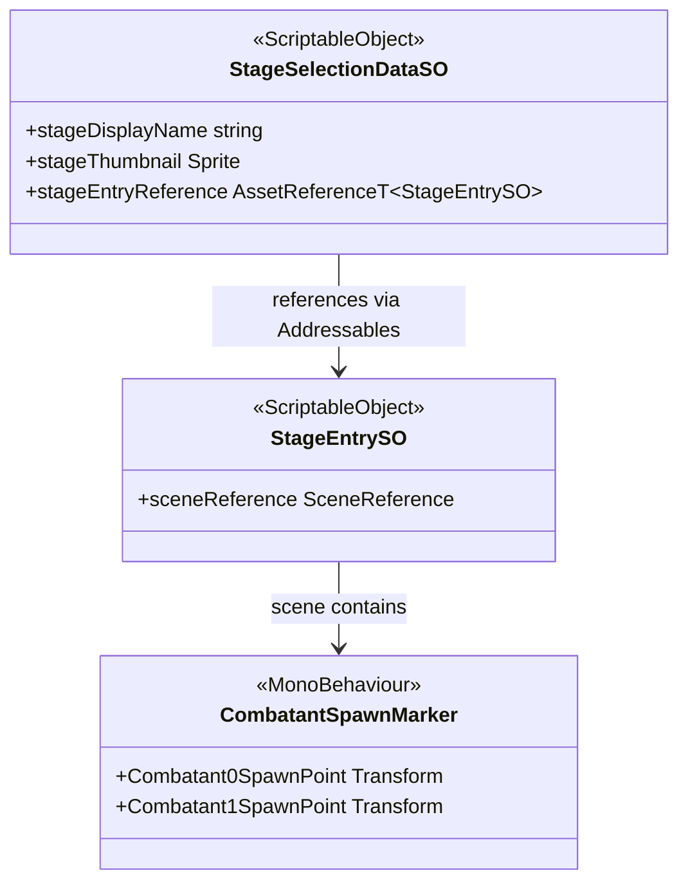

# Stage System

The Stage system provides the data assets and scene-side MonoBehaviour that define a playable
stage. `CombatSession` loads stages via Addressables using `StageEntrySO`; `CombatManager`
reads `CombatantSpawnMarker` from the loaded scene to position characters at round start.

---

## Architecture



---

## Components

### StageEntrySO

`ScriptableObject` that represents one playable stage. Holds a `SceneReference` (Eflatun
package wrapper) to the stage scene. `CombatSession.LoadAsync` loads this asset first, then
uses `sceneReference` to load the scene additively.

Create via: **Unwind Database → Stage → Stage Entry**

| Field | Type | Description |
|---|---|---|
| `sceneReference` | `SceneReference` | Addressable reference to the stage scene. |

---

### StageSelectionDataSO

`ScriptableObject` containing the display data shown in the stage-selection UI. Does not
participate in loading — the UI reads `stageEntryReference` and hands it to `GameManager`
inside `CombatEncounterData`.

Create via: **Unwind Database → Stage → Stage Selection Data**

| Field | Type | Description |
|---|---|---|
| `stageDisplayName` | `string` | Human-readable name shown in the selection UI. |
| `stageThumbnail` | `Sprite` | Preview image displayed alongside the stage name. |
| `stageEntryReference` | `AssetReferenceT<StageEntrySO>` | Addressable reference to the `StageEntrySO`. |

---

### CombatantSpawnMarker

`MonoBehaviour` placed **once** in every stage scene. `CombatManager.PositionCombatants`
calls `Object.FindAnyObjectByType<CombatantSpawnMarker>()` after scene activation and reads
the two spawn transforms to teleport both combatants.

| Property | Type | Description |
|---|---|---|
| `Combatant0SpawnPoint` | `Transform` | World-space spawn for combatant 0; null when unassigned. |
| `Combatant1SpawnPoint` | `Transform` | World-space spawn for combatant 1; null when unassigned. |

Display labels (`combatant0SpawnMarkerLabel`, `combatant1SpawnMarkerLabel`) are auto-populated
from the marker GameObject names in `Reset` and kept in sync in `OnValidate`.

---

## Public API

### StageEntrySO

| Member | Type | Description |
|---|---|---|
| `sceneReference` | `SceneReference` | Addressable scene reference loaded by `CombatSession`. |

### CombatantSpawnMarker

| Property | Returns | Description |
|---|---|---|
| `Combatant0SpawnPoint` | `Transform` | Spawn transform for slot 0; null if marker not assigned. |
| `Combatant1SpawnPoint` | `Transform` | Spawn transform for slot 1; null if marker not assigned. |

---

## Usage

```csharp
// CombatEncounterData bundles the stage reference for GameManager:
var encounter = new CombatEncounterData
{
    Combatant0 = combatant0DataReference,
    Combatant1 = combatant1DataReference,
    Stage = stageSelectionData.stageEntryReference,
};
await _gameManager.BeginCombat(encounter, p0Provider, p1Provider);
```

**Adding a new stage:**

1. Create a new Unity scene and add the stage environment.
2. Place a `CombatantSpawnMarker` GameObject in the scene. Assign the two spawn-point
   child GameObjects in the Inspector.
3. Add the scene to the Addressables group.
4. Create a `StageEntrySO` asset (`Unwind Database → Stage → Stage Entry`) and assign
   the scene reference.
5. Create a `StageSelectionDataSO` asset and assign the display name, thumbnail, and a
   reference to the `StageEntrySO`.
6. Register the `StageSelectionDataSO` in the stage-selection data list used by the
   `CombatantSelectScreen`.

---

## Constraints

- Every stage scene must contain exactly one `CombatantSpawnMarker`. `CombatManager` throws
  an exception if none is found after scene activation.
- Both spawn markers (`combatant0SpawnMarker`, `combatant1SpawnMarker`) must be assigned.
  `OnValidate` logs a warning when either is missing.
- `StageEntrySO` is loaded as an Addressable by `CombatSession`; the asset must be in an
  Addressables group. Do not reference it directly via `Resources`.
