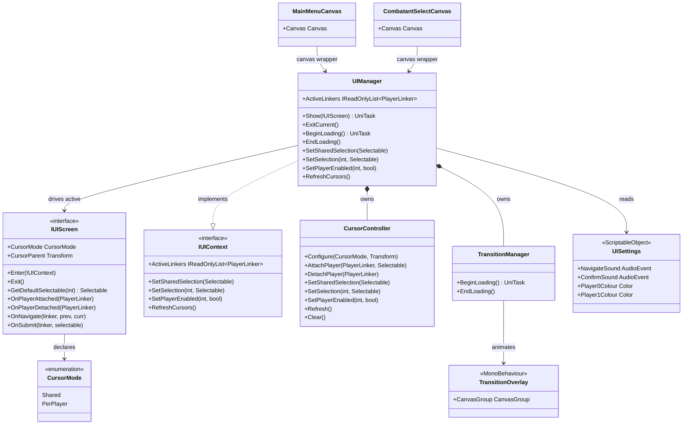

# UI System

The UI system bridges controller hardware to menu screens. `UIManager` is the single owner of
all menu infrastructure: it tracks which controllers are attached to the active screen, routes
their navigate and submit input, drives the cursor, plays UI sounds, and runs the fade between
screens. Screens (`IUIScreen`) own only their panels and domain events — all controller wiring,
action-map switching, and cursor placement are handled by `UIManager` so screen code stays free
of this plumbing.

---

## Architecture



The system is split into three roles:

- **Manager** (`UIManager`) — the only stateful object; subscribes to `PlayerRegistry` for
  controller join/leave, owns the `CursorController` and `TransitionManager`, and runs the
  `Show` / `ExitCurrent` lifecycle. `GameManager` calls `Show(screen)` at each state
  transition; screen code calls back through `IUIContext` to move selections.
- **Screens** (`IUIScreen`) — self-contained UI units that own their panels, domain events, and
  per-player setup, but delegate all controller and cursor infrastructure to the context they
  receive from `UIManager.Enter`.
- **Cursor** (`CursorController`) — manages cursor prefab instantiation, placement, per-player
  enabled state, and the shared ↔ per-player overlap logic. Two cursor models exist: `Shared`
  (one cursor, all controllers drive it) and `PerPlayer` (one cursor per player, shown as a
  merged shared cursor when both rest on the same selectable).

---

## Components

### UIManager

`IUIContext, IDisposable` singleton, constructed once by Reflex. The only object that holds
the active screen reference and the list of attached controllers.

**Screen lifecycle**

| Method | Description |
|---|---|
| `Show(IUIScreen)` | Fades to black, tears down the previous screen, configures the cursor, calls `Enter`, attaches all current controllers, fades back in. Sound preload is awaited before Enter. |
| `ExitCurrent()` | Detaches every controller, calls `Exit()`, clears cursor. No fade — used when `GameManager` owns the surrounding transition. |

**Transition helpers** (delegated to `TransitionManager`)

| Method | Description |
|---|---|
| `BeginLoading()` | Fades the screen to black. Await before loading resources. |
| `EndLoading()` | Fades back in. Called automatically by `Show` after setup completes. |

**Selection and cursor helpers** (implement `IUIContext`; call from screen code)

| Method | Description |
|---|---|
| `SetSharedSelection(selectable)` | Moves the shared cursor; valid only in `Shared` mode. |
| `SetSelection(playerId, selectable)` | Moves one player's cursor; valid only in `PerPlayer` mode. |
| `SetPlayerEnabled(playerId, bool)` | Enables/disables a player's UI input and cursor. On disable, reverts the controller to the Game action map. |
| `RefreshCursors()` | Recomputes cursor visibility and placement from current selections. |

**Sound wiring** — `UIManager` preloads `NavigateSound` and `ConfirmSound` in its constructor
via `_soundsPreloadTask = PreloadSoundsAsync().Preserve()`. `Show()` awaits this task before
proceeding, so the first navigation is never silent. The `.Preserve()` pattern allows
multiple `await` calls on the same completed task without re-running the preload.

**Controller join/leave** — `UIManager` subscribes to `PlayerRegistry.OnPlayerJoined` and
`OnPlayerLeft` in its constructor. When a controller joins while a screen is active, `AttachLinker`
is called immediately; when it leaves, `DetachLinker` unsubscribes its input and reverts its
action map. Selection state is preserved so a reconnecting controller resumes at the selectable
it held before disconnecting.

---

### IUIScreen

Contract for any screen shown by `UIManager`. Implementations hold their own canvas references,
button sets, and domain events (`OnPlayRequested`, `OnEncounterReady`, etc.).

| Member | Description |
|---|---|
| `CursorMode` | Declares which cursor model this screen uses (`Shared` or `PerPlayer`). |
| `CursorParent` | The canvas `Transform` under which cursor prefabs are instantiated. |
| `Enter(IUIContext)` | Activation entry point. Store the context for later `SetSelection` / `SetPlayerEnabled` calls. |
| `Exit()` | Deactivation; clear transient per-session state. |
| `GetDefaultSelectable(int playerId)` | Returns the selectable a player's cursor should land on when attaching with no prior selection. |
| `OnPlayerAttached(PlayerLinker)` | Called after the manager has attached a controller. |
| `OnPlayerDetached(PlayerLinker)` | Called after the manager has detached a controller. |
| `OnNavigate(linker, previous, current)` | Navigation notification; `previous` may be null on first focus. |
| `OnSubmit(linker, selectable)` | Submit notification; react to button presses on specific selectables. |

---

### IUIContext

The narrow surface screens use to request selection or cursor changes from `UIManager`. Screens
receive a reference to this interface via `Enter`; they must not retain it past `Exit`.

Screens must never touch `PlayerInput`, `MultiplayerEventSystem`, or `InputSystemUIInputModule`
directly — all controller infrastructure goes through `IUIContext`.

---

### CursorController

Owns cursor prefab instances and per-player selection state. Two modes:

**`Shared`** — no per-player cursor objects. All controllers' event systems are pointed at the
same selectable. Used by screens where player identity does not matter (main menu).

**`PerPlayer`** — each player has a cursor object positioned on their individual selectable.
When both players rest on the same selectable, the shared (two-tone) cursor replaces both
individual cursors. Selection state survives controller disconnects via a `Dictionary<int,
PlayerCursorState>` keyed by player ID.

| Method | Description |
|---|---|
| `Configure(mode, parent)` | Sets the cursor model and instantiates the prefab; resets all state. Call once per screen activation. |
| `AttachPlayer(linker, focus)` | Registers a controller and focuses its cursor on `focus`. |
| `DetachPlayer(linker)` | Unregisters a controller and hides its cursor; selection state is preserved. |
| `SetSharedSelection(selectable)` | Moves the shared-mode cursor and mirrors the focus to all controllers. |
| `SetSelection(playerId, selectable)` | Moves a per-player cursor and updates that controller's focus. |
| `SetPlayerEnabled(int, bool)` | Hides or shows a player's cursor and records the enabled state for reconnect. |
| `Refresh()` | Recomputes cursor visibility and the shared ↔ per-player overlap without changing selections. |
| `Clear()` | Destroys the cursor instance and resets all state. Called by `ExitCurrent`. |

---

### UISettings

`ScriptableObject` injected as a value singleton. Holds all tuneable UI configuration.

| Field | Type | Description |
|---|---|---|
| `NavigateSound` | `AudioEvent` | Played on every controller navigation event. |
| `ConfirmSound` | `AudioEvent` | Played on every submit event. |
| `Player0Colour` | `Color` | Border colour for player 0's selection cursor. |
| `Player1Colour` | `Color` | Border colour for player 1's selection cursor. |

`UISettings` is optional in `RootInstaller`: if the Inspector field is unassigned, a default
`ScriptableObject` instance is created and a warning is logged.

---

### TransitionOverlay / TransitionManager

`TransitionOverlay` is a `MonoBehaviour` on the `Transition/TransitionCanvas/Overlay` prefab
node. It exposes a `CanvasGroup` that `TransitionManager` animates when `BeginLoading` and
`EndLoading` are called.

`TransitionManager` wraps `TransitionOverlay` and is owned by `UIManager`. Callers go through
`UIManager.BeginLoading()` / `UIManager.EndLoading()`.

---

### MainMenuCanvas / CombatantSelectCanvas

Thin wrapper value types registered in `GameInitializer`. They hold the `Canvas` components
found in the `GlobalSystems` prefab hierarchy and are injected into the screen constructors
so screen code can reference its own canvas without doing its own `GetComponent` calls.

---

## Public API

### UIManager

| Method / Property | Returns | Description |
|---|---|---|
| `ActiveLinkers` | `IReadOnlyList<PlayerLinker>` | Controllers currently attached to the active screen. |
| `Show(screen)` | `UniTask` | Full fade-in/out screen switch. Await before the next UI operation. |
| `ExitCurrent()` | `void` | Synchronous tear-down without fade. |
| `BeginLoading()` | `UniTask` | Fade to black. |
| `EndLoading()` | `void` | Fade back in. |
| `SetSharedSelection(selectable)` | `void` | Shared-mode cursor move. |
| `SetSelection(id, selectable)` | `void` | Per-player cursor move. |
| `SetPlayerEnabled(id, bool)` | `void` | Enable/disable a player's UI input and cursor. |
| `RefreshCursors()` | `void` | Recompute cursor placement from current selections. |

### IUIScreen (implementors must provide)

| Method | Description |
|---|---|
| `Enter(IUIContext)` | Called when the screen becomes active. |
| `Exit()` | Called when the screen is torn down. |
| `GetDefaultSelectable(int)` | Initial focus when a controller attaches without prior selection. |
| `OnPlayerAttached(PlayerLinker)` | Controller attached notification. |
| `OnPlayerDetached(PlayerLinker)` | Controller detached notification. |
| `OnNavigate(linker, prev, curr)` | Navigation notification. |
| `OnSubmit(linker, selectable)` | Submit notification. |

---

## Usage

```csharp
// GameManager driving screen transitions:
await _uiManager.Show(_mainMenuScreen);
// ... player presses Play ...
await _uiManager.Show(_combatantSelectScreen);
// ... encounter selected ...
await _uiManager.BeginLoading();
// load session assets here
await _combatManager.PrepareCombat(session, p0, p1);
_uiManager.ExitCurrent(); // screen is gone; caller owns the fade

// Screen code reacting to controller input:
public void OnSubmit(PlayerLinker linker, Selectable selectable)
{
    if (selectable == _playButton)
        OnPlayRequested?.Invoke();
}

// Per-player screen locking in a selection:
public void OnSubmit(PlayerLinker linker, Selectable selectable)
{
    _context.SetPlayerEnabled(linker.PlayerId, false); // lock cursor, revert to Game map
    _lockedIn[linker.PlayerId] = true;
    CheckBothReady();
}
```

---

## Constraints

- `Show` must be awaited before calling any `IUIContext` method on the new screen — cursor
  configuration happens inside `Show` and is not complete until the task returns.
- `IUIContext` is only valid between `Enter` and `Exit`. Do not store a reference to it past
  `Exit()`; it will point to a stale screen state.
- `SetSharedSelection` is only valid for `CursorMode.Shared` screens. `SetSelection` and
  `SetPlayerEnabled` are only valid for `CursorMode.PerPlayer` screens. Calling the wrong method
  for the mode is a no-op with a warning.
- `ExitCurrent` is synchronous and performs no fade. Always call `BeginLoading()` first if
  the exit should be hidden (e.g. before loading combat assets).
- `UISettings` sound events must be preloaded before first play. `UIManager` does this
  automatically in its constructor; never play `NavigateSound` / `ConfirmSound` directly
  without going through `UIManager`.
- Screen implementations must not hold references to `PlayerInput` components or event systems
  directly. All controller lifecycle goes through `IUIContext` and the screen's notification
  callbacks.
