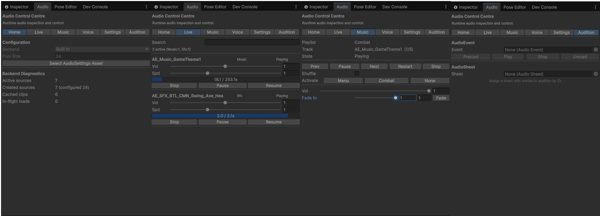
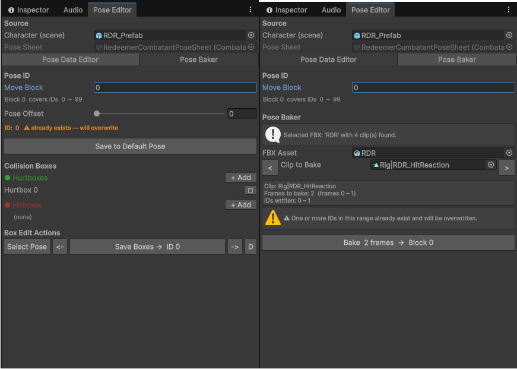
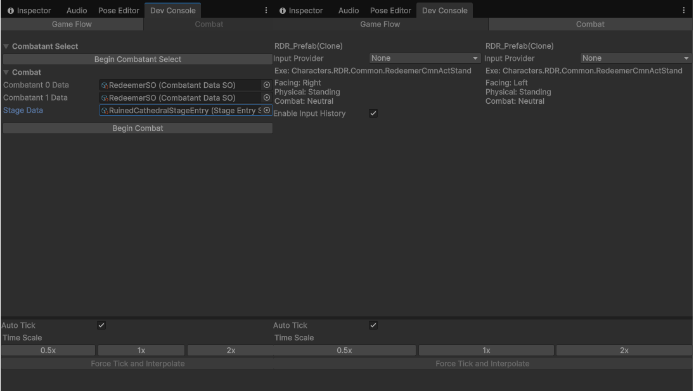

# Project Unwind: Showcase and Conclusion

Project Unwind started as a course assignment and quietly turned into something personal. Since wrapping up Roll-a-Ball
I have tried to put a few hours into it most days, and at some point it stopped feeling like coursework and became the
thing I did in the evenings. That probably shows in the scope: a 2.5D fighting game is not the safe choice for a
deadline, but it was the one I actually wanted to build.

## Coming In

I had game development experience from another engine and knew some C#, though not deeply. Unity clicked quickly.
Alongside the project I worked through a lot of general Unity material that never touched this codebase directly, things
like DOTS and Burst, which I will not list because none of it shipped here, but all of it changed how I read the engine.
If I rebuilt this game today, or started a different one, I would make very different structural choices, and that shift
is the part of the course I value most.

## Inspiration

I did not do this in a vacuum. A friend who works as an indie developer gave me design callouts early. He also helped
me pull apart how Arc System Works structure their fighters in UE5. Their games lean on an in-house scripting language,
so nothing ported across; I had to reimagine the ideas as something Unity-shaped, which is how the move-script and tick
systems ended up looking the way they do.

## The Audio CC

Audio was the side of a game I had always spent the least time on, so I overcorrected. I built an Audio Control Centre
that lets me visualise and tinker with sound live in the editor. None of it was necessary for the game or the
submission, and I would not defend it on a schedule, but finishing it was one of the most satisfying parts of the whole
project.

## What Was Cut

Stamina and the Unique Ability system are real parts of the design, not afterthoughts, but a fighting game is enormous
and time is finite. With the deadline real, I prioritised the deliverable requirements and the UX around actually
playing the prototype: menus, in-game explanations, and the polish that makes a build legible to someone who has never
seen it. The signature mechanics are designed and waiting; they are the next thing rather than a shipped one.

## Showcase

### Audio Control Centre

### Pose authoring

### Combat debug

## Conclusion

This project has tought me a lot about game development, and what aspects of development are most interesting for me.
I have learned a lot about Unity, and probably most of it can be applied to other engines.  
I would actually want to see this game finished...

---
Author: Taggerkov  
Update: 25/05/26  
Source: [GitHub](https://github.com/Taggerkov/project-unwind)
