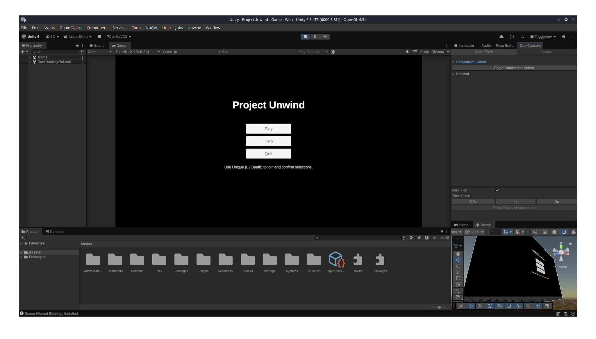
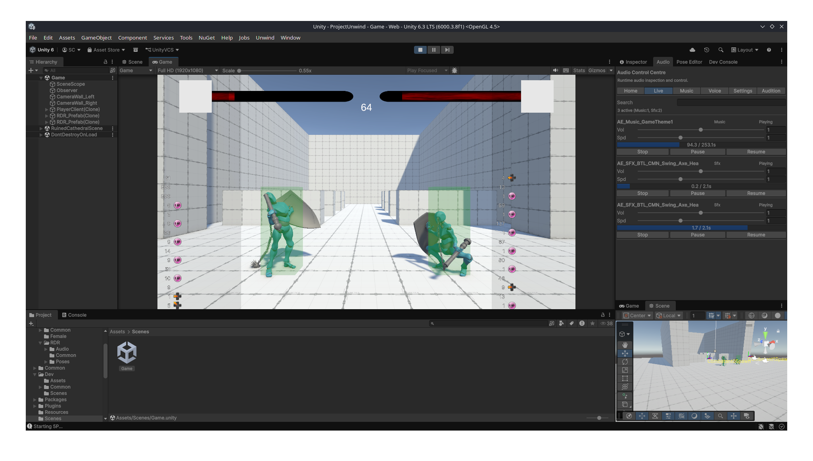

# Project Unwind

A 2.5D, one-versus-one fighting game built in Unity 6 (URP) for the GMD course. Two combatants fight on a 2D plane
rendered with 3D assets and lighting, in a Medieval European grimdark setting. Design and combat feel take Arc System
Works (Guilty Gear, BlazBlue) as their reference point, prioritising mechanical depth over newcomer approachability.

All game logic is pure C# running on a fixed 60 Hz tick system; Unity handles rendering, physics, and the editor.

## Links

- **Play WebGL build:** [GitHub Pages](https://taggerkov.github.io/project-unwind/) (tested on Windows: Firefox / Edge)
- **Demo video:** [YouTube](https://youtu.be/4-222222222)

## Blog Posts

1. [Roll-a-Ball: Building My First Unity Scene](Blogs/P1_Roll-a-Ball.md)
2. [Game Design Document](Blogs/P2_GDD.md)
3. [Milestone 1: The Tick System](Blogs/P3_Milestone1.md)
4. [Milestone 2: The Combat System](Blogs/P4_Milestone2.md)
5. [Milestone 3: The Playable Core](Blogs/P5_Milestone3.md)
6. [Showcase and Conclusion](Blogs/P6_Conclusion.md)

## Controls

Six action buttons and 8-directional movement per player, playable on gamepad or keyboard. Direction uses numpad
notation in character space (6 is always toward the opponent).

| Action  | Gamepad    | Keyboard | Notation |
|---------|------------|----------|----------|
| Move    | Left Stick | W A S D  | 8 4 2 6  |
| Light   | A          | U        | L        |
| Medium  | B          | I        | M        |
| Heavy   | X          | O        | H        |
| Unique  | Y          | L        | U        |
| Guard   | LT         | J        | G        |
| Ability | RT         | K        | AB       |

## Building

Open the project in Unity 6.3 (URP). There is no CLI build; use the Unity Editor. After cloning, run
`configure-unity-git.sh` once to set up the git hooks.

Use the Game.unity scene to play the game.

## Third-Party Code

Pulled via the Unity Package Manager (see `Packages/manifest.json` for exact versions):

- [Reflex](https://github.com/gustavopsantos/reflex): dependency injection
- [UniTask](https://github.com/Cysharp/UniTask): allocation-free async/await for Unity
- [R3](https://github.com/Cysharp/R3): reactive extensions
- [Eflatun.SceneReference](https://github.com/starikcetin/Eflatun.SceneReference): type-safe scene references
- [NuGetForUnity](https://github.com/GlitchEnzo/NuGetForUnity): NuGet package support

Imported directly under `Assets/Plugins/`:

- [KinematicCharacterController](https://assetstore.unity.com/packages/tools/physics/kinematic-character-controller-99131) (
  Philippe St-Amand): physics character movement
- [SerializedCollections](https://assetstore.unity.com/packages/tools/utilities/serialized-dictionary-243052) (
  AYellowpaper): serialised dictionaries in the Inspector

Additional .NET libraries via NuGetForUnity: Microsoft.Bcl.AsyncInterfaces, Microsoft.Bcl.TimeProvider,
System.ComponentModel.Annotations, System.Threading.Channels.

## Third-Party Assets and Tutorials

## Roll-a-Ball Demo

Blog 1 documents a different, self-contained demo project built earlier in the course. It lives in its own repository,
and its documentation, including its third-party asset and tutorial credits, is in that repository's README.

## Screenshots

## Author

Taggerkov. The GitHub-username to name to student-number table is included in the WISEflow submission PDF.